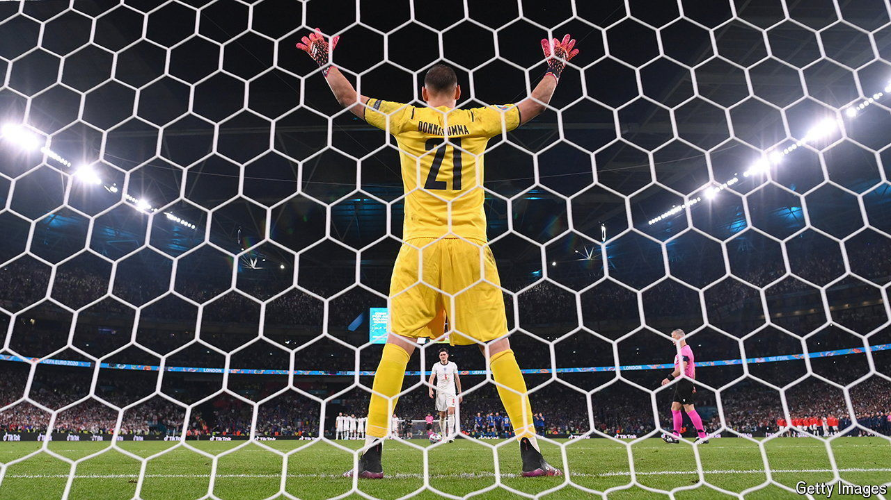

###### Sweet spot

# The secret to taking better penalties 

##### Practise with an augmented-reality headset 

 

> Jun 14th 2024 

ARE YOU reading, Gareth Southgate? As the England football manager prepares for this year’s European championship, a Swiss neuroscientist is offering some help with the England team’s Achilles heel: penalty shoot-outs. (As a player,  is perhaps best remembered for missing a decisive spot-kick in a shoot-out against Germany in 1996.)

Penalty kicks are used at the knockout stage of major tournaments to determine the outcome of drawn games. They have decided the winner in more than 20% of World Cup matches, including the final in 2022, when France lost to Argentina. More than 30% of shoot-out kicks are missed, but pros and pundits disagree on the value of practising them.

