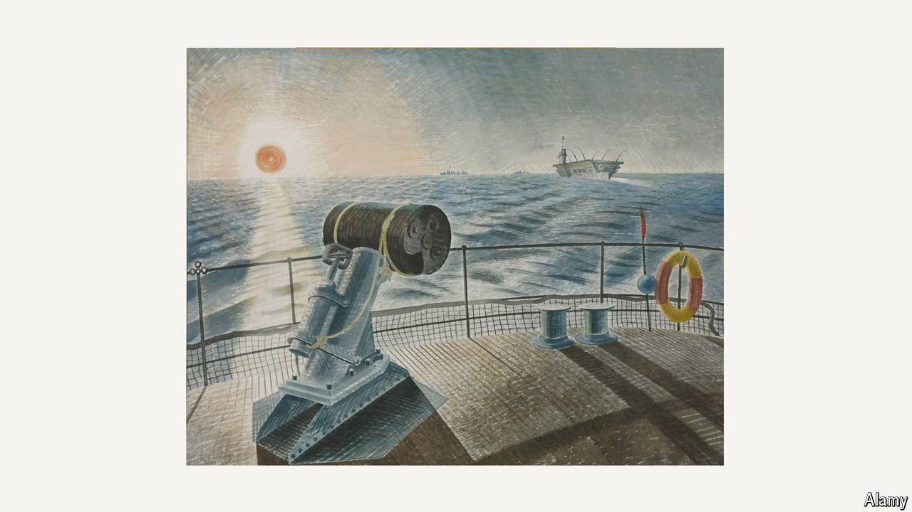

###### The Economist looks at

# How to stare at the Sun, through art 

##### Seven artworks use the Sun to talk of time, the Earth, the act of seeing and industrial civilisation 

 

> Jun 19th 2024 

CHILDREN—and eclipse-watchers—are warned not to stare directly at the Sun. Ignore that advice and the result may be burnt retinas and partial blindness. Yet an urge persists to somehow see the source of the light by which once all things were seen. Central to the world but always moving in the sky, bringing days into being and governing the cycles of the year—it is hard not to see the fascination, even if you sensibly avert your eyes. 

Visual artists, from the prehistoric to the contemporary, provide a safer way for Sun-worshippers and the Sun-curious to deepen their appreciation. As solar power becomes an ever more important energy source around the world, here are seven artworks that also harness the Sun’s energy and deepen its resonance. 

