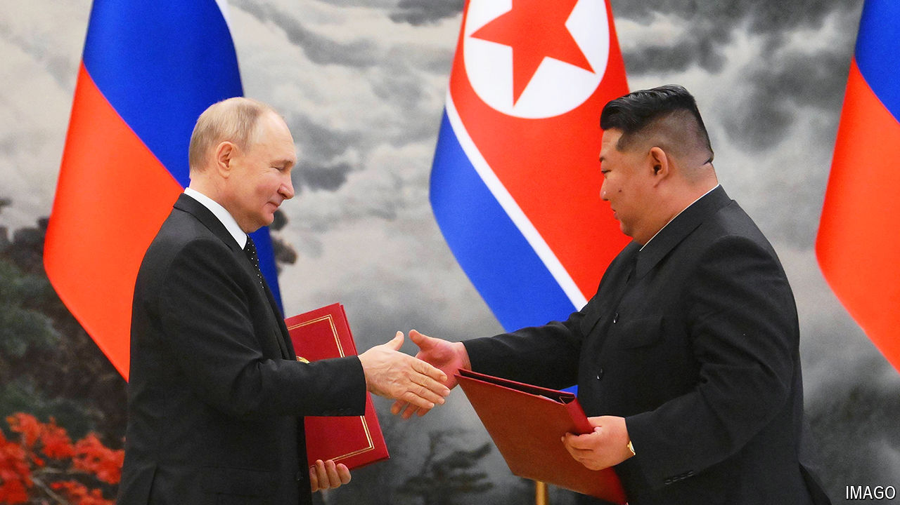

###### The world this week

# Politics 

#####  

 

> Jun 20th 2024 

 visited . The  president was given an elaborate welcome before holding talks with Kim Jong Un, the Asian country’s dictator. The pair have strengthened their alliance during the war in Ukraine, with North Korea providing Russia with weapons. The West fears that in return Russia is helping North Korea with its nuclear programme. Both leaders signed a mutual-defence pact. Mr Putin then went to , where he was also given the full state-visit treatment. 

South Korean soldiers fired warning shots at North Korean troops who had breached the demarcation line in the  that separates the South and North. It was the second such incident in a week, though South Korea thinks the breaches were accidental. 

