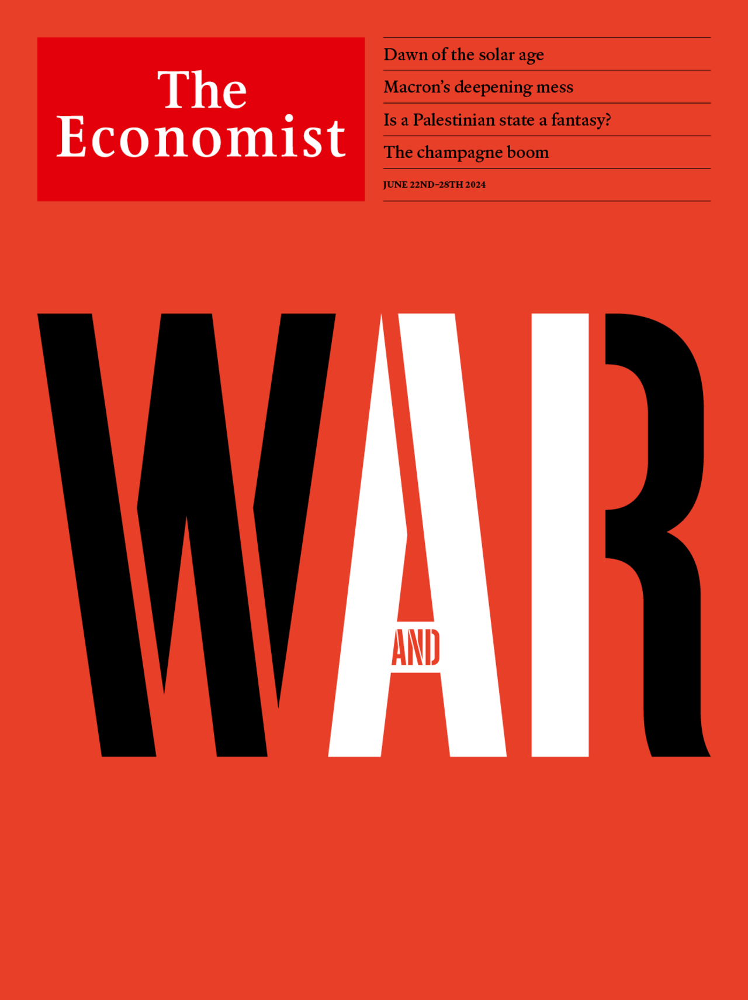

###### The Economist

# This week’s covers 

##### How we say the world 

> Jun 20th 2024 

This week we had two covers. In the EU we explored how the character of warfare is about to be profoundly changed by artificial intelligence (AI). This rapid change has several causes. One is the crucible of war itself, most notably in Ukraine. A second is the recent exponential advance of AI. A third is the rivalry between America and China, in which both see AI as the key to military superiority. The scale of ai-based war means that mass and industrial heft are likely to become even more important than they are today. The uncertainties are profound. The only sure thing is that ai-driven change is drawing near. 

 


