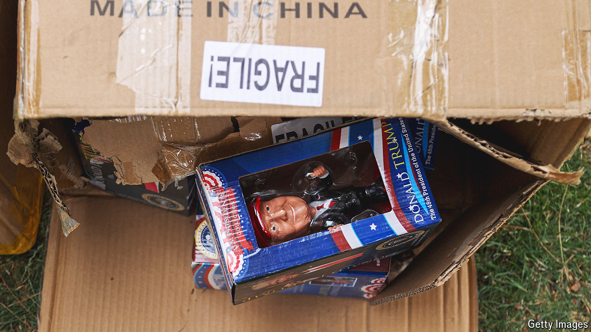

###### Freezing time

# Are America’s leading presidential candidates up to it? 

##### Americans are worryingly unconfident in the sanity of the two men 

 

> Jun 20th 2024 

“I really hate doing this, but I cannot not do it,” announced the conservative host Hugh Hewitt on his online show. This was a preface to a montage of video clips showing “President Biden’s obvious and increasing infirmity”. 

One, from a star-studded fund-raiser held in Los Angeles on June 15th, shows Mr Biden staring blankly at the audience before Barack Obama, the night’s other headline act, grasps his arm and leads him offstage. The second, taken a few days earlier at the G7 summit in Italy, appears to show Mr Biden wandering away from other world leaders as they watch a skydiving demonstration. In conservative corners of the media and the internet, such clips of Biden freezes abound. Another recent entry shows the president staring blankly at a White House concert celebrating the new federal holiday of Juneteenth on June 19th, which marks the end of slavery. 

