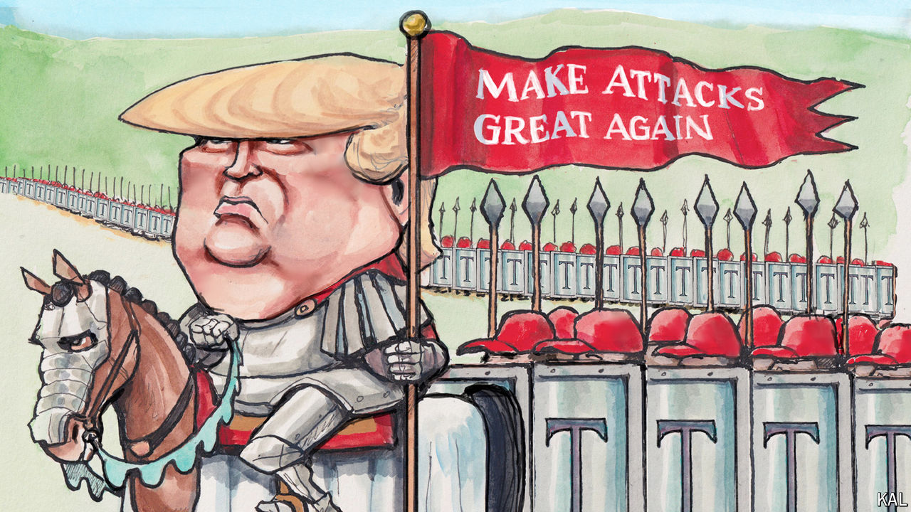

###### Lexington

# Donald Trump has finally got it right about the January 6th insurrectionists 

##### They were “warriors”—that’s the problem 

 

> Jun 20th 2024 

Here is a thought experiment. Try to put politics and the presidential race out of your mind and give Donald Trump the benefit of the doubt about the attack on the Capitol on January 6th 2021. Accept that he believed the election was stolen and that he meant it when he told the crowd that day to march from the White House to Capitol Hill “peacefully and patriotically”. Accept that he believed none of his supporters was carrying weapons or intended violence of any sort. Accept that he has since come to conclude, as he has claimed, that Nancy Pelosi, then the speaker of the House, somehow “caused” the violence, that the police “ushered in” the crowd, that they were “a loving crowd”, indeed, “patriots” who have since become not just “victims” but even “hostages” of a weaponised system of justice. 

Then ask yourself this: after embracing all of those assumptions and assertions, why would you celebrate the rioters as “warriors”, as Mr Trump did during a rally earlier this month? 

