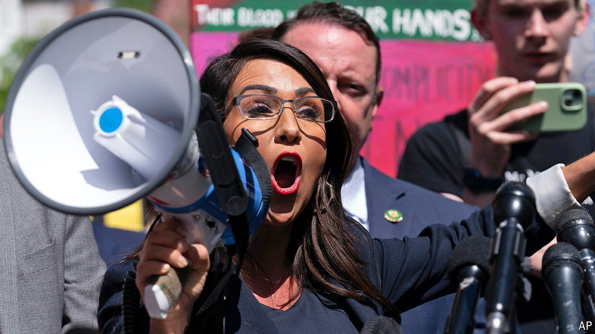

###### On the trail in Colorado

# Lauren Boebert’s primary is a window into everyday Trumpism 

##### Republican primary voters’ favourite thing is anything that horrifies Democrats 

 

> Jun 20th 2024 

A week BEFORE Colorado’s primary elections, which take place on June 25th, Richard Holtorf was busy feeding cattle and preparing his ground for planting wheat. But the 59-year-old had politics on his mind as he stepped down from a massive tractor at his ranch on the state’s eastern plains. After a brief oration on the deficiencies of battery-powered farming equipment, Mr Holtorf explained why he was running in the Republican primary and hoping subsequently to win a seat in the US House of Representatives. 

After gaining legislative experience as minority whip in the state House, Mr Holtorf has developed a desire to influence policy at a higher level. And then there is Lauren Boebert. “She hasn’t done anything except run her mouth and showboat and carry a pistol around, and showboat some more,” he argues. Ms Boebert—who before entering politics ran Shooters Grill in Rifle, Colorado—first defeated a Republican incumbent in 2020, despite expressing sympathy for the QAnon conspiracy theory.

