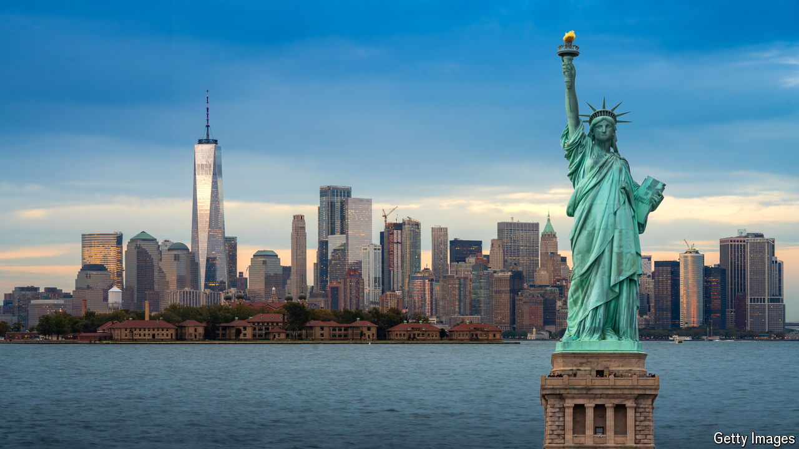
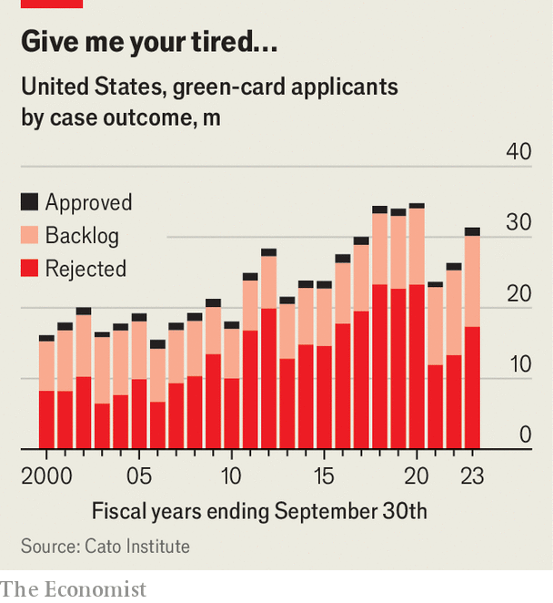

###### Beyond the border

# Legal immigration to America has rebounded 

##### Is anyone paying attention? 

 

> Jun 18th 2024 

REPUBLICAN POLITICIANS often compare America’s southern border to Swiss cheese. It is more like a black hole. Its gravitational pull is so strong that officials can think only of enforcement and security (or the good electoral politics that come with harping on about enforcement and security). The names of small, dusty border towns—Eagle Pass, Jacumba Hot Springs—have never been so well known. The black hole leaves little time to consider the other parts of America’s creaking immigration system, such as refugees, skilled-worker visas or reforming quotas that are decades out of date. 

 


