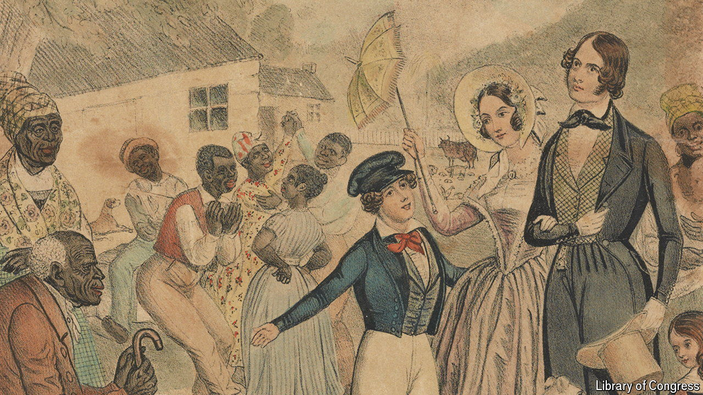

###### The second sex

# New research exposes the role of women in America’s slave trade 

##### In the bondage of others they saw their freedom 

 

> Jun 18th 2024 

They didn’t know how bad it was. That was how James Redpath, a northern journalist who toured the South in the 1850s, explained white southern women’s support for slavery to his readers. He reckoned that women were shielded from the “most obnoxious features” of the trade—rarely witnessing the auctions and the lashes doled out as punishments on plantations—and were oblivious to the “gigantic commerce” that it had become. Over time historians came to agree that slavery was the business of men. 

Research published last month shatters that narrative. Economists at Ohio State University analysed data from the New Orleans slave market, the biggest of them all, to quantify women’s involvement. They found that women were buyers or sellers in 30% of all transactions and 38% of those that involved female slaves. By matching names to census records they show that it was not just single or widowed women who dealt in slaves because they lacked husbands; married ones did, too. 

