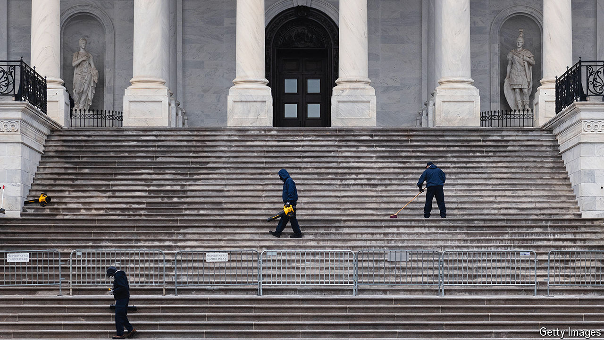

###### Preparing for a takeover

# Republicans are favoured to win the Senate. What would they do? 

##### Congressional Republicans are already considering the art of the possible 

 

> Jun 17th 2024 

Donald Trump’s visit to Capitol Hill on June 13th served as a reminder that—whatever the candidate promises—Congress will have a critical role in shaping policy if he returns to the White House. Although  largely support their presumptive nominee and his programme, the finer points of a potential second-term agenda remain up for debate. 

’s election-forecast model reckons that Donald Trump is more likely than not to retake the presidency. A Trump victory would probably be accompanied by Republicans gaining control of the Senate and perhaps expanding their majority in the House. Congressional Republicans are already considering the art of the possible if they do so.

