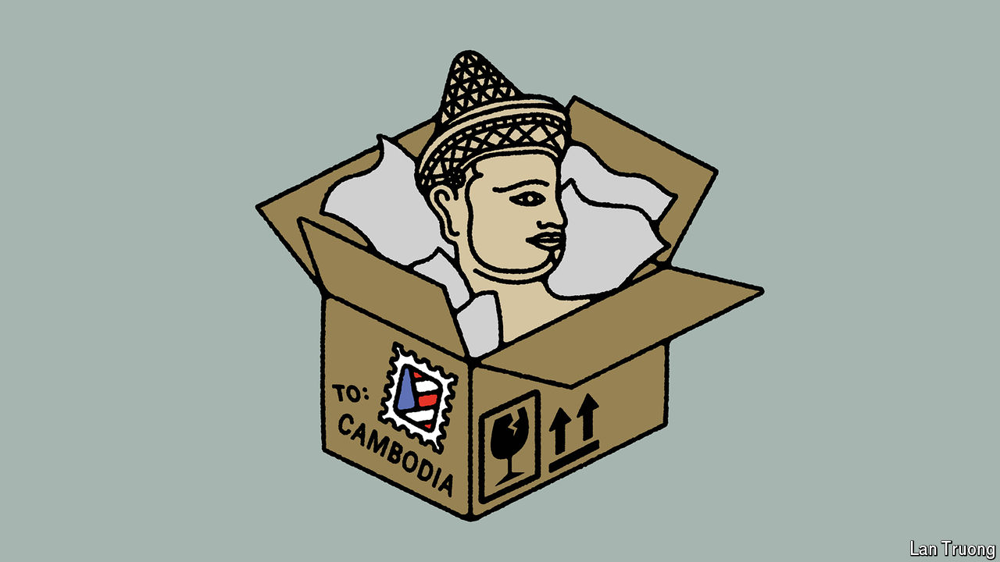

###### Banyan

# Ancient artistic loot will finally make its way back to Cambodia 

##### On July 3rd the Metropolitan Museum in New York will return artefacts to the country 

 

> Jun 27th 2024 

Most sculptures in Cambodia’s national museum are missing something. Surya, a sun god, recently returned from the Denver Art Museum without its arms or legs. A Hindu warrior has lost its head. Looters probably nabbed it during what Brad Gordon, an American lawyer helping Cambodia reclaim stolen statues, claims is “the biggest art theft in history”. 

The plundering of Cambodian heritage was widespread and recent. Between the 1970s and 1990s the country faced a genocide and civil wars. Thieves took advantage of turmoil. Wielding shovels and pickaxes, they hacked stone gods from most of Cambodia’s 4,000 temples. American authorities allege that many statues passed through Douglas Latchford, an expert in Cambodian antiquities. He was indicted in America in 2019 for trafficking looted relics and falsifying documents (he died before facing the charges). He sold Cambodian art to rich collectors. Lots of it probably ended up in museums.

