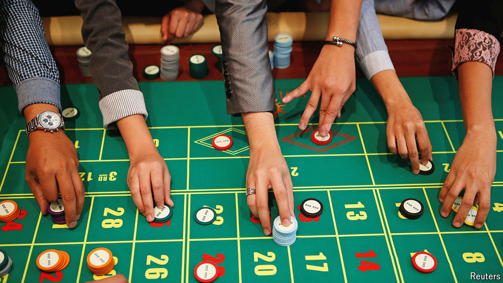

###### Beginner’s luck?

# Casinos are booming in South-East Asia 

##### Thailand could soon become the latest country to jump on the bandwagon 

 

> Jun 27th 2024 

Lush jungles, pristine beaches, cheap booze and, as of late, readily available marijuana: Thailand seemingly has something for every kind of tourist. But punters in search of a flutter would disagree. Apart from a government lottery and state-controlled horse-racing, gambling is illegal. So for those who enjoy betting, they must cross Thailand’s borders. In Cambodian and Laotian towns on the other side, casinos cater to their needs.

However, such arduous journeys may soon no longer be needed. Riding on a wave of liberalisation—cannabis was decriminalised in 2022 and same-sex marriages were legalised this month—Thailand is now close to permitting casinos. Earlier this year, the Thai parliament backed a study on the feasibility of casino resorts. That paved the way to legislation, which could come in a matter of weeks, according to the deputy finance minister. 

