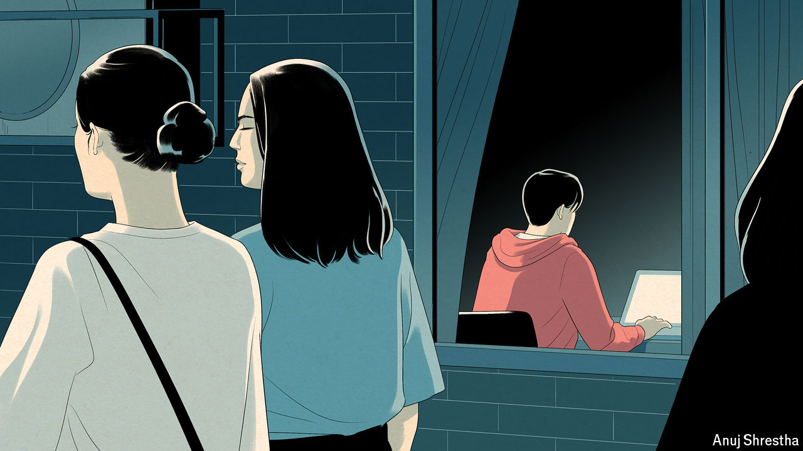

###### Rebels without much cause

# Meet the incels and anti-feminists in Asia 

##### They threaten to make the region’s demographic decline even worse 

 

> Jun 27th 2024 

KIM WOO-SeoK, a 31-year-old chef in Seoul, grew up questioning the way society treats women. He felt sorry for his stay-at-home mother. He considered himself a feminist. But over the past few years, his opinions have shifted. When he came across women activists online, he was shocked to see some of them were making demeaning comments about men, including making fun of small penises. “I felt like my masculinity was under attack,” says Mr Kim. He believes that, since the 2010s, Korean society has become more discriminatory against men than women. Although he has a girlfriend, many of those who share his beliefs in the region do not. 

In advanced countries the gap between the sexes has widened, with young men tending to be more conservative and young women tending to be more liberal. The trend is particularly striking in East Asia. Men are not adapting well to a society where women are better educated, compete with them for jobs and do not want to have babies with them. According to one survey in 2021, 79% of South Korean men in their 20s believe they are victims of “reverse discrimination”. In neighbouring Japan, a survey the same year found that 43% of men aged 18 to 30 “hate feminism”. 

