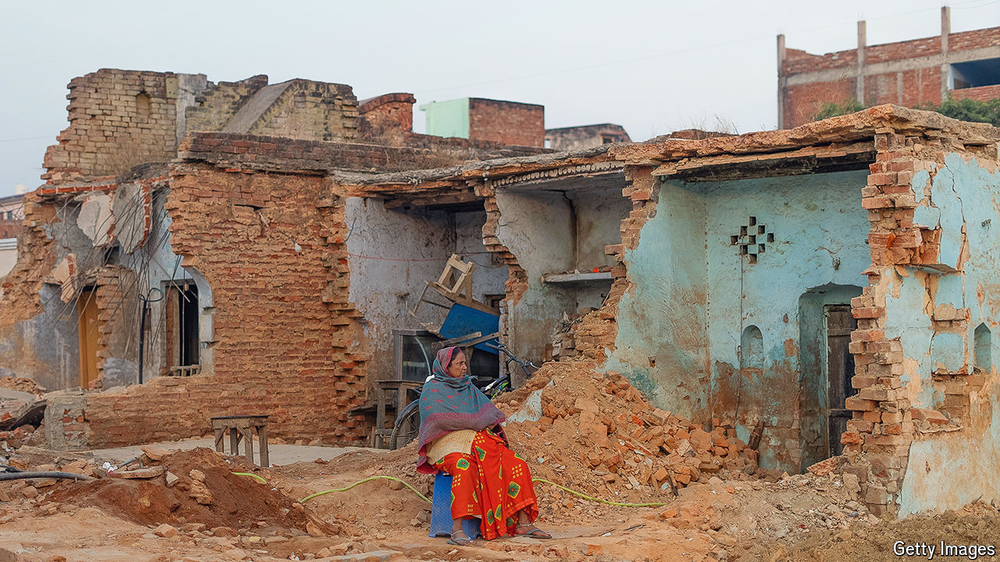

###### Left wanting

# Narendra Modi needs to win over low-income Indians 

##### They are dissatisfied with their share of the country’s growth 

 

> Jun 27th 2024 

DURGA PRASAD YADAV used to be a big fan of Narendra Modi, India’s prime minister, and his Bharatiya Janata Party (BJP). “Back in 2014 they promised jobs and development. I thought they would improve things for ordinary people,” says the 36-year-old farmer from a village near Ayodhya in the northern state of Uttar Pradesh (UP). In January Mr Modi inaugurated a new temple in the city on the site of a mosque that was demolished by a Hindu mob in 1992. The project has been accompanied by a big development drive. Yet Mr Yadav says local people like him have seen little improvement in their day-to-day lives. “All the development around here has meant loss for the people of Ayodhya,” says Mr Yadav. “Only outsiders have benefited.” He is not especially fond of the opposition. But in the national election that ended in early June, he voted for them anyway. 

In Ayodhya and across UP, many voters made the same choice, reducing the BJP’s share of seats in the state in its northern heartland from 62 out of 80 in 2019 to just 33, its biggest loss in any state. The party also lost 14 seats in Maharashtra, mostly in rural areas, and ten seats in Rajasthan, another poor northern state, as well as in rural constituencies across India. Besides (unfounded) concerns that a new BJP government could abolish affirmative-action policies benefiting poor or lower-caste groups, the party’s losses hint at a general sense of economic disaffection among the roughly 450m Indians, mostly from the country’s poor north, who get by on odd jobs, small-scale self-employment or farming, supplemented by government welfare. 

