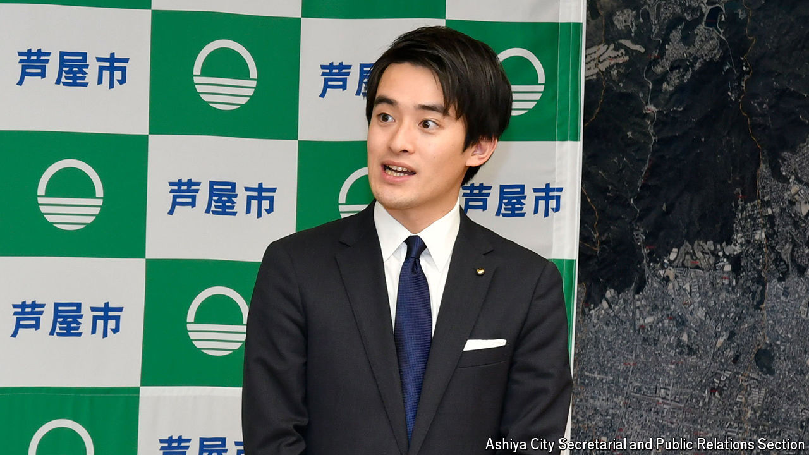

###### Gen Z mayor

# Takashima Ryosuke is Japan’s youngest ever mayor 

##### At 27 years old, he is bucking the trend of the country’s gerontocratic politics 

 

> Jun 27th 2024 

After graduating from Harvard University, Takashima Ryosuke could have gone into consulting or finance, like many of his friends. Instead he embarked on an unusual career path for a Japanese youngster. In 2023, at the age of 26, Mr Takashima was elected mayor of Ashiya, a town in western Japan. “Being a mayor seemed like a career that would allow me to impact society the most,” he says. 

Mr Takashima has set the record as the youngest mayor in Japan. He stands out in a country with a gerontocratic government. When Kishida Fumio, Japan’s prime minister, reshuffled his cabinet in September last year, the average age of its incoming members was 64. Across politics, younger people are under-represented: in 2022, the share of national politicians aged 40 and under was 6%, compared with 29% in Germany and 22% in Britain. Low voter turnout among the youth has also worried policymakers; just over 30% of people in their 20s vote in elections, compared with 70% of those in their 60s.

