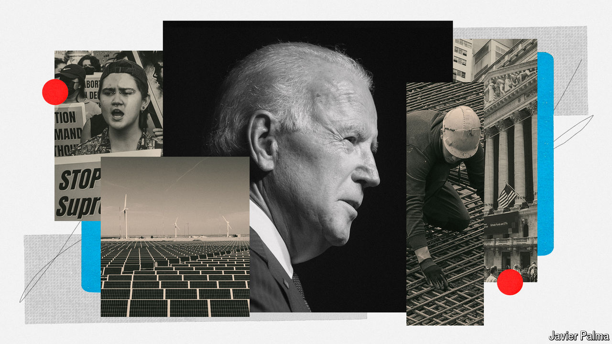

###### The trouble with sequels

# What would Joe Biden actually do with a second term? 

##### He has a domestic agenda, but no easy way to bring it about 

 

> Jun 27th 2024 

MOST OCTOGENARIANS opt for the easy life. President Joe Biden is embarking on a gruelling, billion-dollar campaign to win the privilege of continuing to work until he is 86. To what end exactly? In his previous campaign, in 2019, Mr Biden said he wanted to save “the soul of the nation”—by which he meant depriving Donald Trump of the presidency. Mr Trump’s revenge candidacy this year has prompted Mr Biden to revive his old pitch. Our election model suggests the president has only about a 30% chance of securing re-election, although a debate between the candidates on June 27th could cause the polls to shift. A second victory for Mr Biden would properly vanquish his nemesis. But it would also leave the president with four more years in the White House. What would he do with them?

It is common for presidents to struggle to enact their second-term agendas. George W. Bush did not get far with plans to steer federal spending on health care, retirement and education to the private sector, for instance. Barack Obama’s second term, of which Mr Biden had a front-row view as vice-president, was an endless sequence of fiscal battles with a Republican Congress, ending in a final humiliation when the Senate refused even to vote on Mr Obama’s nominee for a vacant seat on the Supreme Court.

