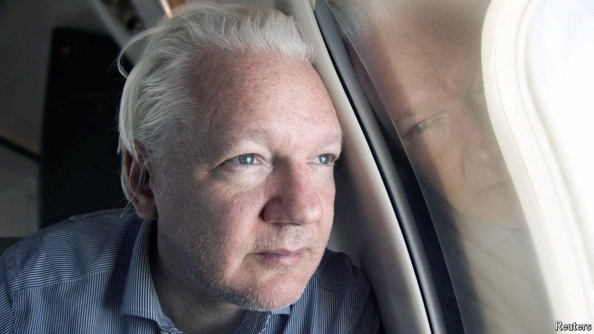

###### Britain’s unwanted house guest

# Julian Assange’s plea deal: a suitable end to a grubby saga 

##### America was right to have sought his extradition. But a bit of compassion now does not go amiss 

 

> Jun 25th 2024 

WHEN an unwanted house guest finally departs, the relief is palpable. So it is with the news that Julian Assange has left Britain. On June 24th the founder of WikiLeaks, a website that publishes classified and sensitive information, walked out of Belmarsh, a high-security prison in south-east London where he has spent the past five years, and hopped on a plane to Thailand. From there he flew to the Northern Mariana Islands, an American territory in the Pacific, where he pleaded guilty to one charge of violating America’s  laws. That fulfilled his side of a deal with the American government, which in return allowed him to go home to Australia. On June 26th he landed in Canberra, a free man.

This appears to mark the end of a long and unedifying legal drama.  was first arrested in Britain in 2010 after Sweden said it wanted to question him over sex-crime allegations (these were later dropped, and he denied them). He claimed asylum in Ecuador’s embassy in London, where he lived for seven years. After Ecuador ran out of patience with him (at one point it claimed that he had smeared faeces on the embassy wall), British police removed Mr Assange and arrested him again. 

