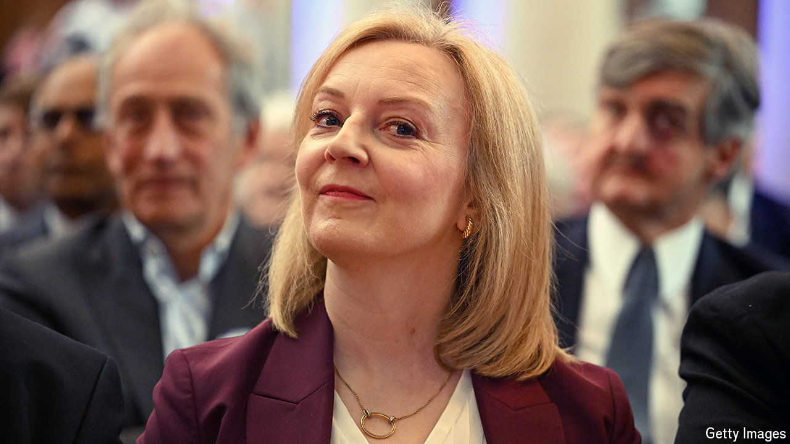

###### Lettuce pray

# On shame, Liz Truss and the turnip Taliban 

##### A local group is trying to eject the former prime minister from her seat 

 

> Jun 27th 2024 

It has been a difficult few years for Liz Truss. First she crashed the British economy. This was painful for her. (“I could hardly sleep,” she writes in her recent memoir.) Then she became the shortest-reigning prime minister in British history (she felt “angry and frustrated”). Then there was that nasty business with the  (“puerile”). To add to her woes, in the middle of her premiership, the queen died. As Ms Truss, ever alive to the emotional needs of the nation, wrote in anguished italics: “?” 

“” is a pertinent question once again. For Ms Truss—“UK Prime Minister, Sept-Oct 2022”, as American television tickers helpfully describe her—is once again standing for election to promote “prosperity and economic growth” and to serve the constituents of South West Norfolk. Somewhat to the alarm of said constituents, who, on a sunny pre-election day, suggest to this correspondent that she is instead standing because she is “arrogant”, “shameless”, lacking in “humility” and—as one local says in the sort of whisper that deserves its own italics—“”. 

