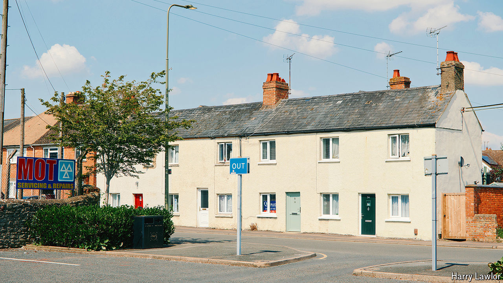
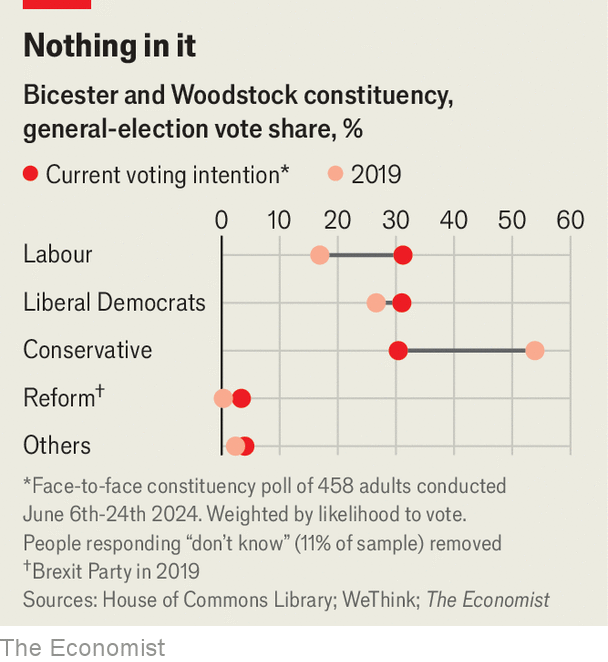

###### Bicester and Woodstock

# The British election is not close. But the race in Bicester is 

##### A potential Tory leader-in-waiting is in a three-way fight 

 

> Jun 27th 2024 

LABOUR WILL, barring the greatest polling upset in British political history,  on July 4th. But if you think the race is boring, take a visit to Bicester and Woodstock in Oxfordshire. In ordinary times, the constituency should be a shoo-in for Rupert Harrison, the Conservative candidate, a centrist who was once considered the “real chancellor” as an adviser to George Osborne during the coalition government and is tipped as a future party leader. Instead he is embroiled in a ferocious battle with Calum Miller, a Liberal Democrat councillor, and Veronica Oakeshott, the Labour candidate, who has a background in the charity sector.

 


