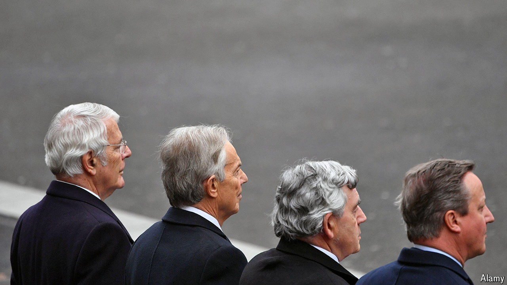
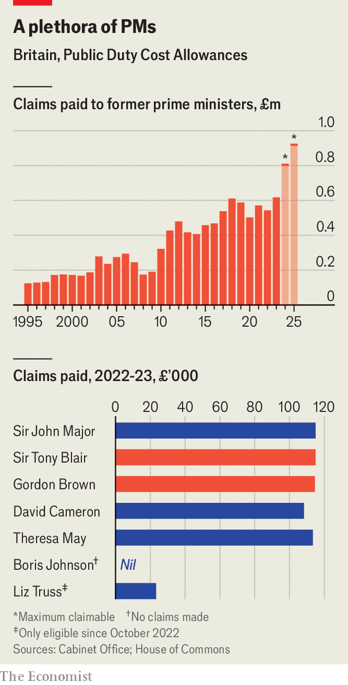

###### The Public Duty Cost Allowance

# The cost of Britain’s cast of ex-prime ministers is mounting 

##### Soon the number of possible claimants will almost certainly be eight 

 

> Jun 24th 2024 

 


Former British prime ministers are entitled to an allowance of up to £115,000 ($146,000) a year for life. The Public Duty Costs Allowance (PDCA) was introduced in 1991 to help Margaret Thatcher adapt to life after Downing Street. The PDCA, which is designed to cover expenses for running an office and the like, is not unusual: America, France and Germany all fork out in similar ways. But their leaders don’t change like the weather. Three former prime ministers claimed from the PDCA 30 years ago, at a total cost to the taxpayer of £250,000 at today’s prices. Ten years ago the number of claimants was still three (Sir John Major, Sir Tony Blair and Gordon Brown). If Rishi Sunak joins the ranks of ex-leaders after the election, the number of possible claimants will rise to eight. Although the PDCA has been frozen since 2011 the bill could balloon to nearly £1m a year. Most former prime ministers claim something, though one exception is Boris Johnson. Perhaps he is as disorganised out of office as he was in it. ■

