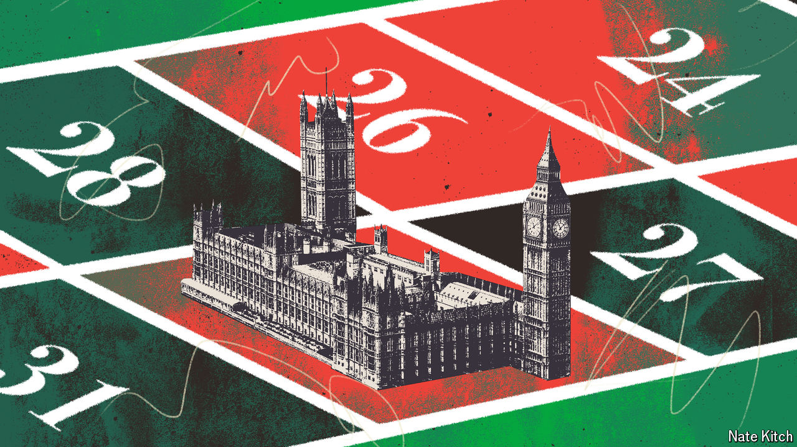

###### Bagehot

# Why the next Westminster scandal is already here 

##### In British politics scandals are not exposed. They are simply noticed 

 

> Jun 26th 2024 

All Westminster scandals are obvious in retrospect. The furore over mps and aides betting on the date of the general election is no exception. Gambling is rife in Westminster. Memoirs are stuffed with amusing anecdotes of special advisers placing wagers: in the general election in 2017, one adviser lumped £8,000 ($10,100) on a Tory victory in the hope of winning £1,000, only to lose it all when Theresa May blew her majority. Gambling permeates everyday political coverage: bookmakers offer odds on everything from election dates to future party leaders, and journalists obligingly write them up. 

So it should be little surprise that, when rumours of a snap election leaked from Tory high command in May, a flock of Conservative MPs, advisers and candidates—as well as police officers who work around Downing Street—put bets on it. Craig Williams, an MP and Rishi Sunak’s parliamentary assistant, was dropped by the party for having a flutter. So was the Conservative candidate in Bristol North West, who happens to be married to the party’s director of campaigns. They, and others, gambled on politics because until this week no one thought it was a problem, never mind potentially illegal. Now that the brakes have slammed on, Mr Williams and colleagues have hurtled through the windscreen. 

