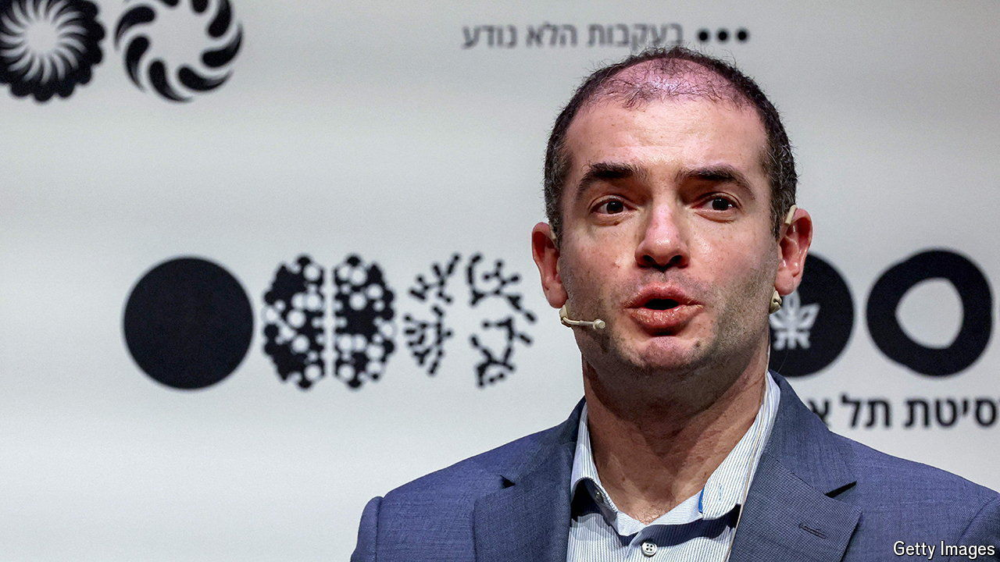

###### Thinking fast and slow

# A new lab and a new paper reignite an old AI debate 

##### Two duelling visions of the technological future 

 

> Jun 27th 2024 

AFTER SAM ALTMAN was sacked from OpenAI in November of 2023, a meme went viral among artificial-intelligence (AI) types on social media. “What did Ilya see?” it asked, referring to Ilya Sutskever, a co-founder of the startup who triggered the coup. Some believed a rumoured new breakthrough at the company that gave the world ChatGPT had spooked Mr Sutskever. 

Although Mr Altman was back in charge within days, and Mr Sutskever said he regretted his move, whatever Ilya saw appears to have stuck in his craw. In May he left OpenAI. And on June 19th he launched Safe Superintelligence (SSI), a new startup dedicated to building a superhuman AI. The outfit, whose other co-founders are Daniel Gross, a venture capitalist, and Daniel Levy, a former OpenAI researcher, does not plan to offer any actual products. It has not divulged the names of its investors. 

