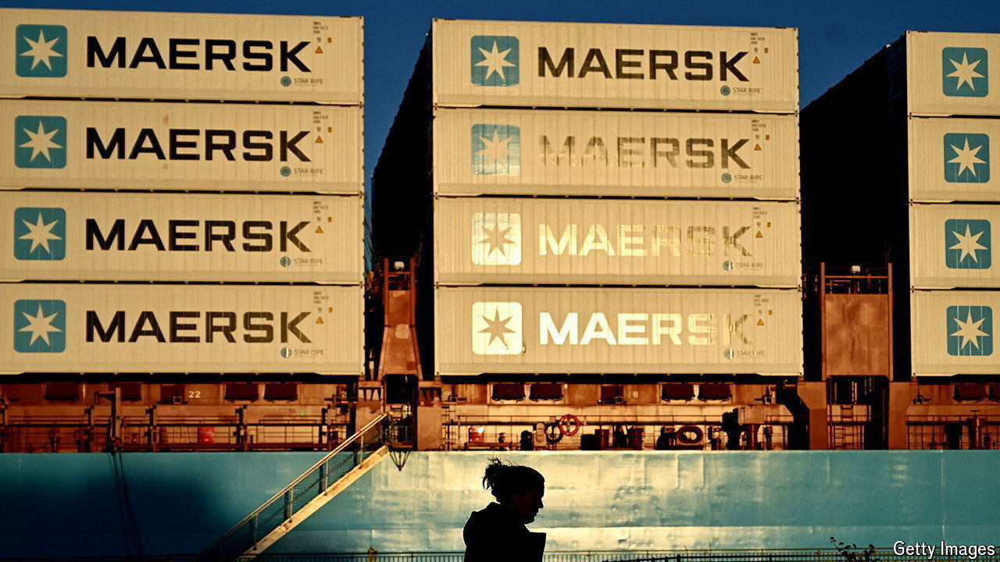

###### Full steam ahead

# Boom times are back for container shipping 

##### Can they last? 

 

> Jun 27th 2024 

Volatile weather is a peril of the high seas. Volatile markets are similarly treacherous for the container-ship industry, which carries 80% of the volume of internationally traded goods. A global pandemic, which kept people at home with little else to do but buy, buy, buy, sent container rates sky-high. In 2022 shipping lines’ return on capital exceeded 40%; the biggest earned profits that were three times the total for the previous two decades combined. Rates and returns tumbled as demand waned and shipping companies started to receive the new vessels ordered during the boom. Then attacks by Houthi rebels on ships in the Red Sea all but closed the Suez Canal. The disruption has sent rates back to records surpassed only during the pandemic. How long will the good times last this time?

On the surface, the answer should be: not long at all. Historically, value destruction has been the industry norm. Bernstein, a broker, reckons that between 2002 and 2019 shipping firms’ average return on capital of 4.7% trailed in the wake of its cost of capital, which averaged 10% or so. New ships take a couple of years to build. According to bimco, an industry association, in 2023 the global fleet added capacity of around 2.3m 20-foot equivalent units (the standard measure of container size), surpassing the previous annual record by 37%. Another 1m arrived in the first four months of 2024. In February worries about overcapacity led A.P Moller-Maersk, the world’s second-largest shipping line, to warn it could lose up to $5bn this year. 

