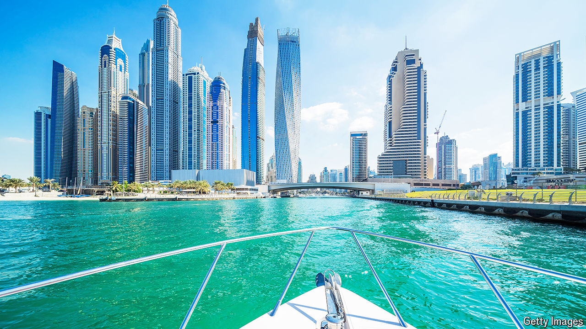

###### Bolt-holes

# European millionaires seek a safe harbour from populism 

##### Many are fleeing to the Gulf—never mind war next door 

 

> Jun 27th 2024 

DUBAI SELLS itself as a refuge for the footloose plutocrat. It is an easy place to do business and has convenient flight connections to just about anywhere in the world. Its streets are safer than New York’s or London’s (not to mention much cleaner). Just in case those attractions are not enough, it levies no tax on income, property or capital gains. 

Small wonder that the United Arab Emirates (UAE), of which Dubai is the glitzy business hub, is forecast to draw a net 6,700 millionaires this year, according to Henley &amp; Partners, a wealth consultancy. That is almost twice as many as are expected to head to America, the historic home of the world’s rich, with 5.5m residents worth $1m or more. Long a bolt-hole for rich Russians, Indians and Arabs from neighbouring countries, Dubai is now attracting a new group of mogul migrants: Europeans fleeing rising political uncertainty at home. 

