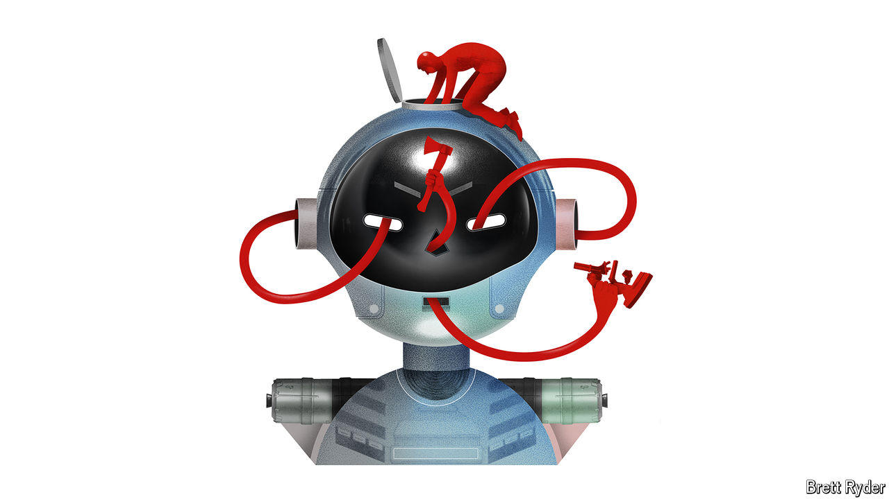

###### Schumpeter

# Is artificial intelligence making big tech too big? 

##### Previous scares have been overblown. This one might not be 

 

> Jun 23rd 2024 

When ChatGPT took everyone by storm in November 2022, it was  the startup behind it, that seized the business world’s attention. But, as usual, big tech is back on the front foot. , maker of accelerator chips that are at the core of generative artificial intelligence (AI), is duelling with Microsoft, a tech giant of longer standing, to be the world’s most valuable company. Like Microsoft, it is investing in a diverse ecosystem of startups that it hopes will strengthen its lead. Predictably, given the “techlash” mindset of the regulatory authorities, both firms are high on the watch list of antitrust agencies.

Don’t roll your eyes. The trustbusters may have infamously overreached in recent years in their attempts to cut big firms down to size. Yet for years big-tech incumbents in Silicon Valley and elsewhere have shown just as infamous a tendency to strut imperiously across their digital domains. What is intriguing is the speed at which the antitrust authorities are operating. Historically, such investigations have tended to be labyrinthine. It took 40 years for the Supreme Court to order E.I. Du Pont de Nemours, a large American chemical firm, to divest its anticompetitive stake in General Motors, which it first started to acquire in 1917 when GM was a fledgling carmaker. The Federal Trade Commission (FTC), an American antitrust agency, is still embroiled in a battle with Meta, a social-media giant, to unwind Facebook’s acquisitions of Instagram and WhatsApp, done 12 and ten years ago, respectively. 

