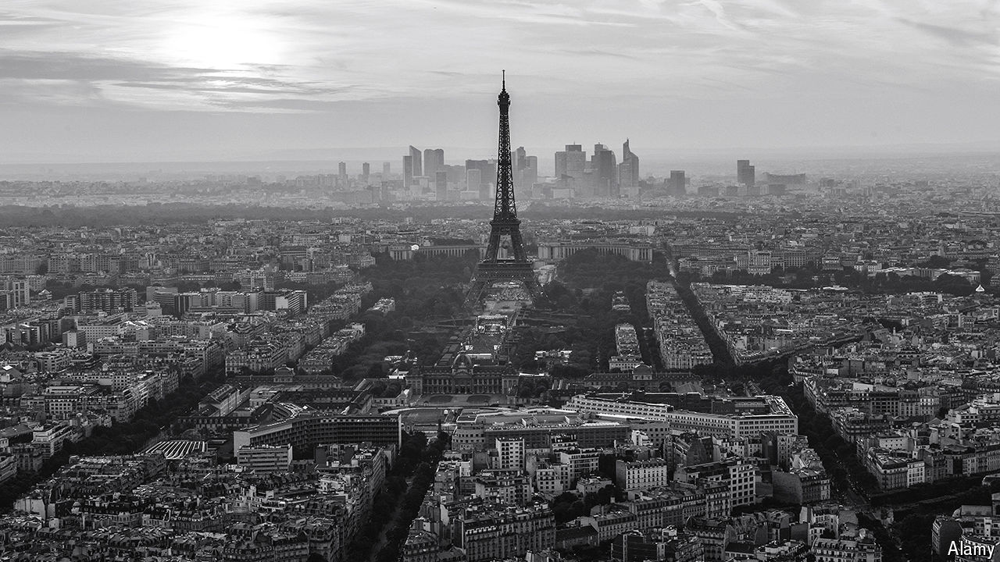

###### Keeping the lights on

# Is the revival of Paris in peril? 

##### The French election threatens a remarkable commercial renaissance 

 

> Jun 26th 2024 

In recent years Paris has undergone an astonishing revival. Global businessmen, financiers and techies casually drop into conversation that they are spending more time in the City of Light. Wall Street banks have expanded their offices there; venture capitalists are signing more cheques for French startups. An annual investment summit, held in May at the nearby Palace of Versailles, has become a fixture in chief executives’ calendars. This year, as they sipped champagne with France’s president, Emmanuel Macron, company bosses pledged investment projects worth €15bn ($16bn). 

The renaissance is part of Mr Macron’s grand ambition to make France more innovative and business-friendly. But that project is now in danger. 

