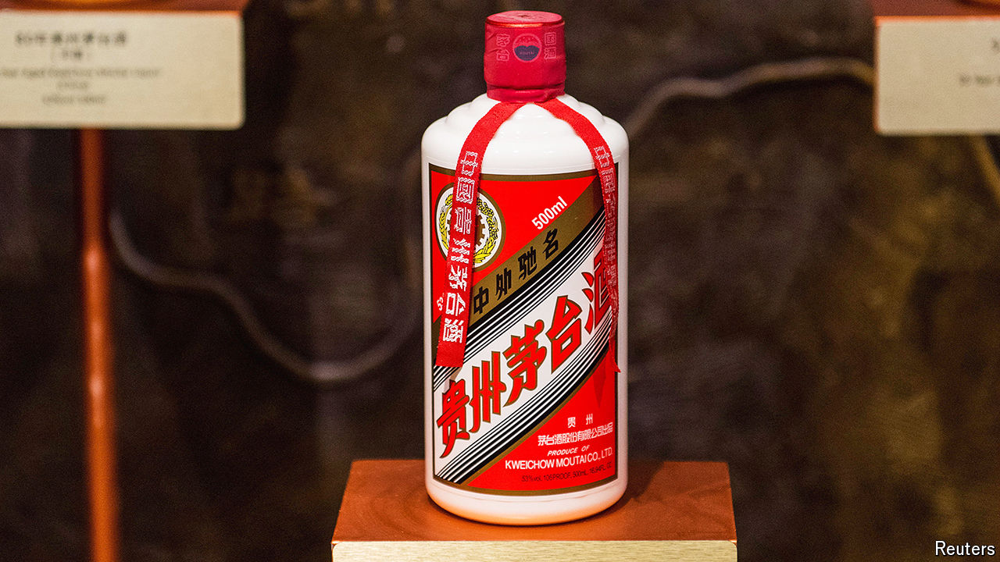

###### The baijiu mystery

# Who shaved $250bn from Kweichow Moutai’s market value? 

##### Hint: it wasn’t Xi Jinping’s anti-corruption drive 

 

> Jun 27th 2024 

THE ROLE of Kweichow Moutai in Chinese society is complex. The state-owned company’s fiery, translucent  is by far China’s favourite booze. It is one of the country’s oldest brands—a rare corporate survivor of the worst days of Maoism. Vintage cases fetch tens of thousands of dollars. In 2021 it was briefly worth a throat-scorching $500bn and in 2022 it eclipsed Tencent, a digital giant, to become for a time the most valuable Chinese listed company.

Today its market capitalisation is half that. Some of the decline has to do with President Xi Jinping’s crackdown on graft, before which prized bottles of the sorghum-based firewater would often change hands in place of cash. When in 2020 state TV accused Moutai of benefiting from bribery, $25bn instantly evaporated from its market capitalisation. 

