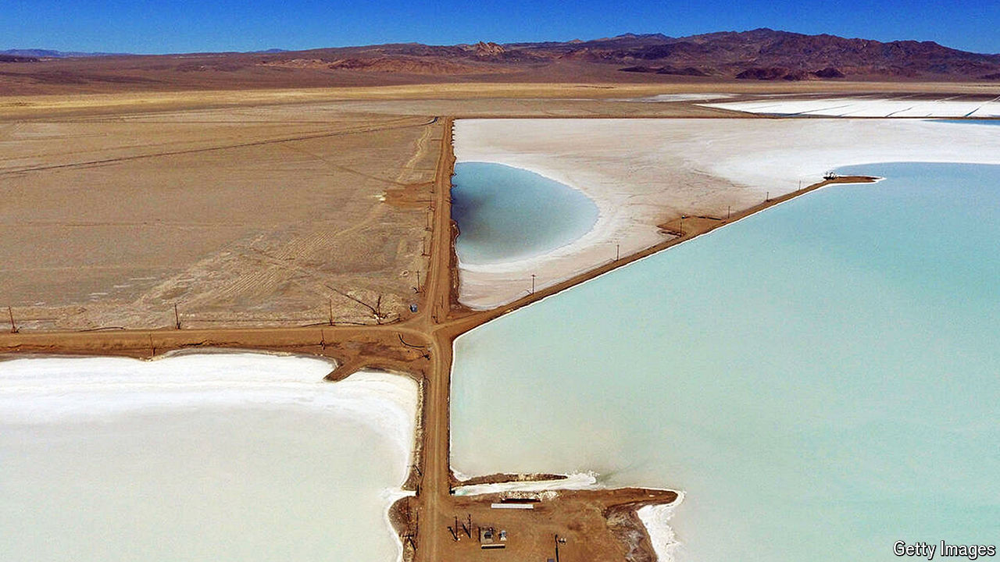

###### Move over, big dirt

# Why big oil is wading into lithium 

##### What black gold and the white metal have in common 

 

> Jun 27th 2024 

BP AND SHELL, two British oil giants, have long sunk cash into solar and wind farms. Their rivals elsewhere have mostly stuck to their drilling. Investors have rewarded single-mindedness. ExxonMobil, an American firm unapologetically wedded to the black stuff, is worth $510bn, half as much again as the British duo combined. Its share price is up by 50% in the past five years, compared with a rise of 10% for Shell and a fall of 13% for BP. 

That is not to say ExxonMobil has no interest in renewables. But rather than getting into generation, it is placing an indirect bet on the energy transition. On June 25th it signed a preliminary agreement to supply lithium to SK On, a South Korean manufacturer whose lithium-ion batteries will power electric Fords and Hyundais. This follows an announcement in November that it was drilling its first lithium well in Arkansas. A “material” part of its $20bn in low-carbon investments between 2022 and 2027 will go to lithium, says Dan Holton, in charge of these projects. By 2030 the company hopes to produce enough lithium to supply 1m electric vehicles (EVs) a year. Darren Woods, its boss, sees lithium as a “high-return” opportunity. 

