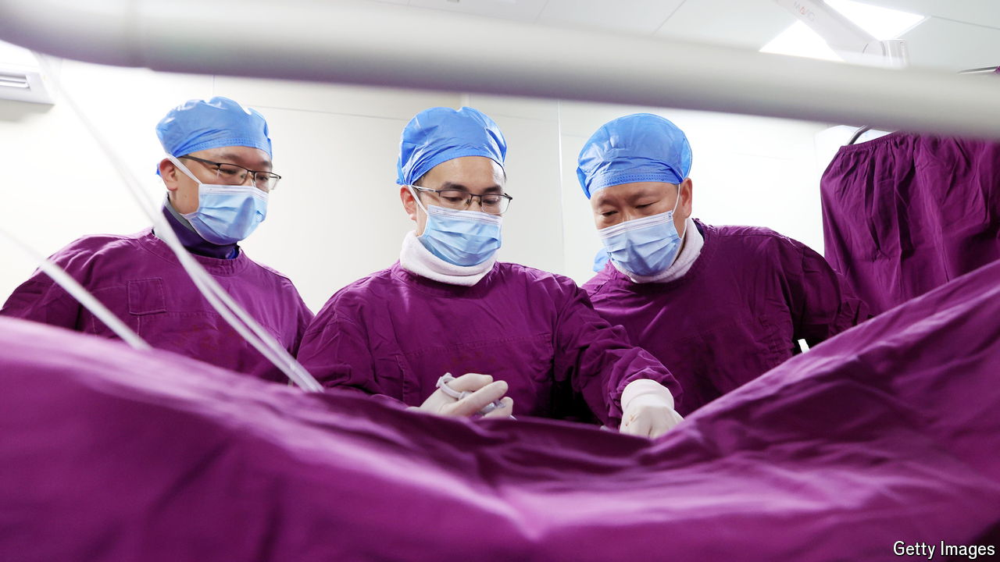

###### Going private

# Health-care reform is upending the lives of China’s doctors 

##### As a result, many are looking towards the private sector 

 

> Jun 27th 2024 

When Cheng Yingsheng, the director of one of China’s top university hospitals, was placed under investigation for alleged corruption in June, it marked a difficult spell for doctors in China. The authorities have recently rattled them with a string of high-profile arrests of leading medical figures. But that is not the doctors’ only worry. The government is also pushing through a health-care reform that is upsetting many of them.

China’s doctors have long felt aggrieved. Their wages ($13,000 a year on average) are low compared with those of other Chinese professionals. Yet they work long hours, often more than 50 a week. That is in part because there are too few of them. China has 2.4 doctors per 1,000 people against an average of 3.7 in the OECD, a club of mostly rich countries. Chinese doctors tend to get less respect than their peers in Hong Kong and Taiwan. Trust in them is so low, and medical scandals so rife, that reports of patients physically attacking them are common. 

