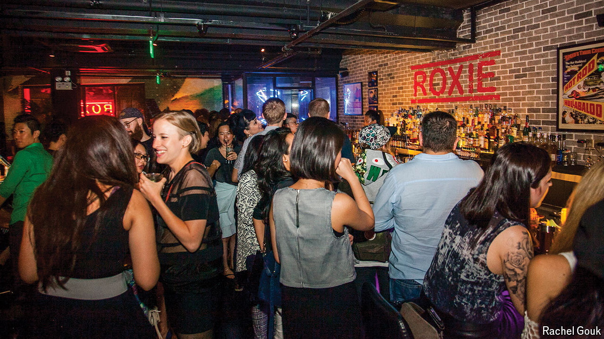

###### Last call

# Roxie, one of China’s few lesbian bars, closes its doors 

##### Yet another sign that life is getting harder for gay people in the country 

 

> Jun 27th 2024 

For nearly a decade Roxie was one of Shanghai’s (and China’s) few lesbian bars. It hosted speed dating and pole dancing, and boasted an unusually risqué decor (patrons were encouraged to hang their bras above the counter). But earlier this month the bar announced that it would close. It blamed “forces beyond our control”, a euphemism for official pressure. On June 16th, Roxie’s last night, grieving revellers danced and drank while holding a large rainbow flag over their heads.

In the early days of Xi Jinping’s rule, LGBT groups were allowed some space. But in recent years life has got much harder for them. Shanghai Pride, the country’s only big gay celebration, has not been held since 2020, also because of official pressure. Last year the Beijing LGBT Centre, an advocacy group, had to close. Authorities often crack down in June as it is Pride month, reckons a former patron of Roxie. “Everything we celebrate, they want to crush,” she says.

