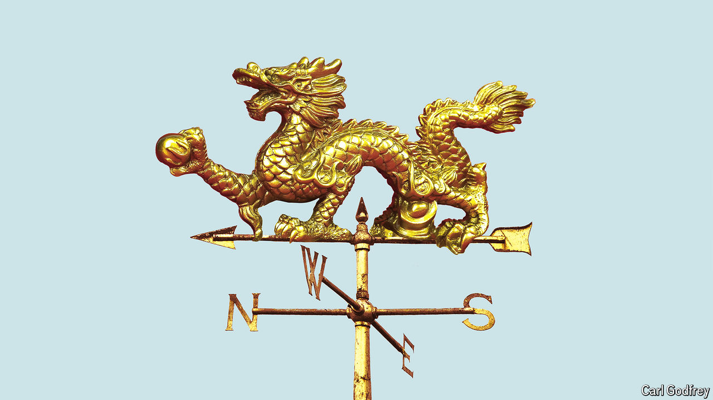

###### Reform in China

# The surprisingly frank economic advice that Xi Jinping gets 

##### The minutes of a party meeting show voices in favour of bolder reform 

 

> Jun 27th 2024 

In politics, fringe ideas can become mainstream and vice versa. The “window of political possibility” can expand or move, as Joe Overton, an American political analyst, once put it. The same is true even in communist China. In 1978, for example, the country’s Overton window made a momentous shift. Two years after the death of Chairman Mao Zedong, it became possible for the party to acknowledge that the great helmsman was not infallible. This pragmatism paved the way for faster economic reform and for Deng Xiaoping to become China’s paramount leader. The change was sealed at a landmark meeting of the party’s central committee: the “third plenum” of December 1978.

China is now preparing for another third plenum, which will be held from July 15th to 18th. It has been over a decade since such a meeting was devoted to economic reform. In principle, the gathering could signal a renewed determination to tackle China’s long-standing economic problems, including weak consumer demand, narrow taxes, miserly social spending, restrictions on internal migrants’ access to services and bureaucratic impediments to private enterprise. It is, therefore, a good time to examine the country’s Overton window: the range of permissible economic opinion within Chinese officialdom. 

