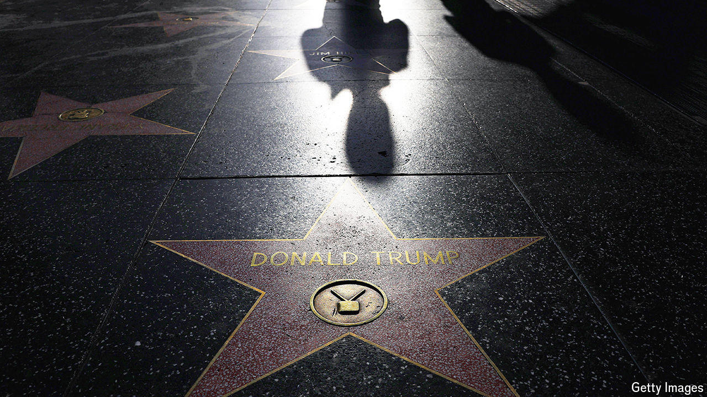

###### Stage fright

# Donald Trump’s return is making Hollywood nervous 

##### News and politics are being left out of the streaming boom 

 

> Jun 21st 2024 

The standing ovation lasted for more than ten minutes. “The Apprentice”, a dramatisation of the early career of , had one of the buzziest premieres at the  in May, with Hollywood grandees in attendance, including Cate Blanchett, an actress, and Oliver Stone, a director. Distributors snapped up the rights to release the title in many countries. But in America no big studio was willing to touch it. The reason is simple, says one American content buyer, glancing around a restaurant in Beverly Hills to check for eavesdroppers: “Fear.”

In some ways Hollywood is more daring than ever. The shift from broadcast to streaming has freed producers from the rules that restrict bad language and  on TV in many countries. Relying more on subscription income and less on advertising has also reduced the need to make inoffensive “brand-safe” content. In the past decade provocative drama has flourished; boundary-pushing comedy is enjoying a rollicking renaissance.

