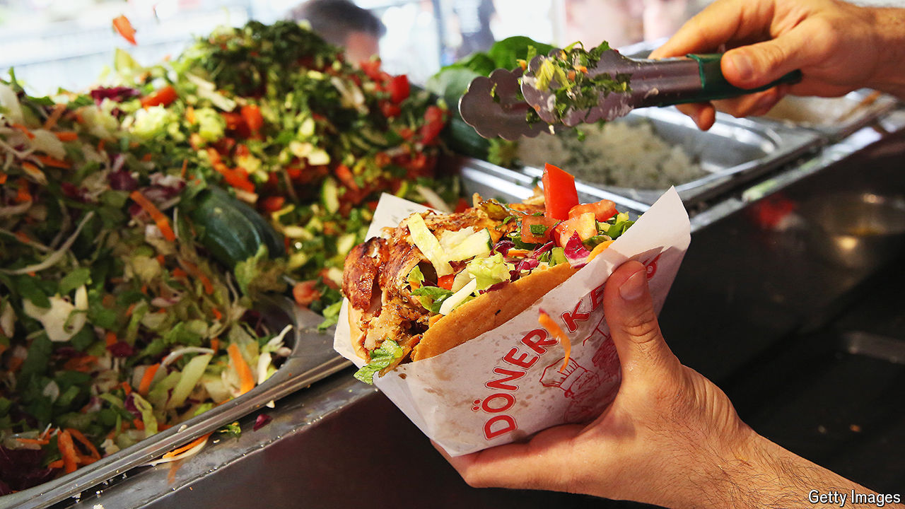

###### World in a dish

# The döner kebab has a meaty role in German society 

##### It is a diplomatic tool as well as a tasty, cheap meal 

 

> Jun 25th 2024 

“I have an onion on my head/I am a kebab/because kebab makes you more beautiful.” It is no surprise that the lyrics of “Döner macht schöner”, a German hit from 2004, do not deliver quite the same emotional payload in English. In Britain the kebab is a byword for drunken excess, devoured before bed and recalled in shame. In Germany, especially its capital, it is a more exalted affair. Every Berliner has a favoured . Many build family outings around them.

The döner kebab (the umlaut is essential) long ago displaced currywurst as . But these days its ubiquity obliges it to carry a lot more than succulent strips of seasoned meat—lamb, veal or beef—served in flatbread with salad and sauces. 

