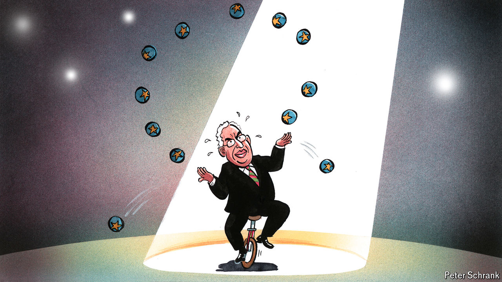

###### Charlemagne

# Can António Costa make a success of the world’s hardest political gig? 

##### He will preside over the European Council 

 

> Jun 27th 2024 

What is the world’s hardest political assignment? Being president of France these days is not much fun. Heading up the North Korean opposition is rarely a stepping stone to promotion. The role of “minister for Brexit opportunities” in London proved so hard it was scrapped in 2022 after just two years and few opportunities found. Of the jobs that endure, that of president of the European Council is perhaps the most confounding. As the chairman of the forum where the European Union’s 27 national leaders meet, the person in the role supposedly controls the room in which historic decisions are made (alongside many more humdrum ones). Yet finding common ground between the skinflint Dutch, hard-right Italians, sermonising Scandinavians and war-rattled Balts requires a deftness of touch few are blessed with. A competent power broker would go a long way to steering the EU through some choppy waters ahead.

Bar a last-minute calamity on June 27th European leaders will plump for António Costa as the next PEC, as the job is known in the Brussels . A former prime minister of Portugal from 2015 until April, the 62-year-old will be the fourth person to hold the position since it was created in its current form in 2009 (it used to rotate between the EU’s various leaders every six months). The job is in effect for five years, meaning Mr Costa will be on the European scene long after France’s Emmanuel Macron has gone, and doubtless outlast the German chancellor Olaf Scholz, too. Making sure that France and Germany are pushing in the same direction is one of the jobs of the PEC, and not one that has been done well in recent years. Of the three cheers that will resound when Mr Costa is confirmed, two of them will be to celebrate the departure of the incumbent, Charles Michel, a former Belgian prime minister who has fumbled his way in the role since 2019.

