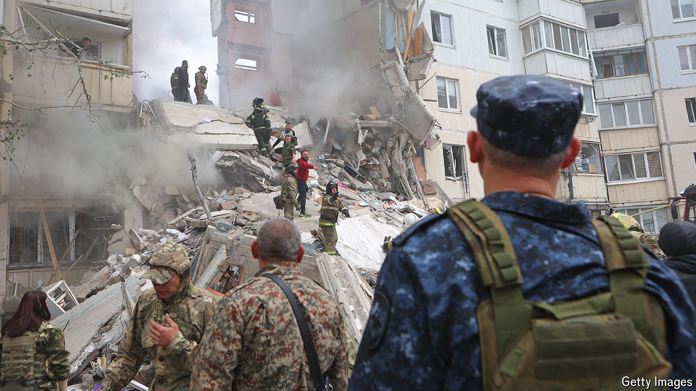

###### Belgorod

# Death and destruction in a Russian city 

##### Russians in the border city of Belgorod have become victims too in the war Vladimir Putin launched against Ukraine 

 

> Jun 24th 2024 

FOR MOST people in Belgorod, once a quiet and comfortable Russian city 40km from the Ukrainian border, the war started on December 30th 2023, almost two years after it began in . That day the centre of Belgorod was hit by a Ukrainian rocket, killing 25 civilians, including two children, and wounding more than a hundred. Since then the city and the province that surrounds it have been attacked almost daily. Some 200 civilians have died and 800 have been wounded—small numbers compared with what Ukraine has endured, but far more than anywhere else in Russia.

Mikhail Ivankiv, a 22-year-old final-year student at Belgorod State University, had just finished shopping for New Year presents for his parents and his fiancée. That New Year was supposed to be the start of his new life, his father says. “He had found his first job, and was about to move in with his fiancée. They planned to celebrate New Year’s Eve together and he said he would come and see us the next day.” He never did. A few days later Mikhail died in hospital, after losing both his legs.

