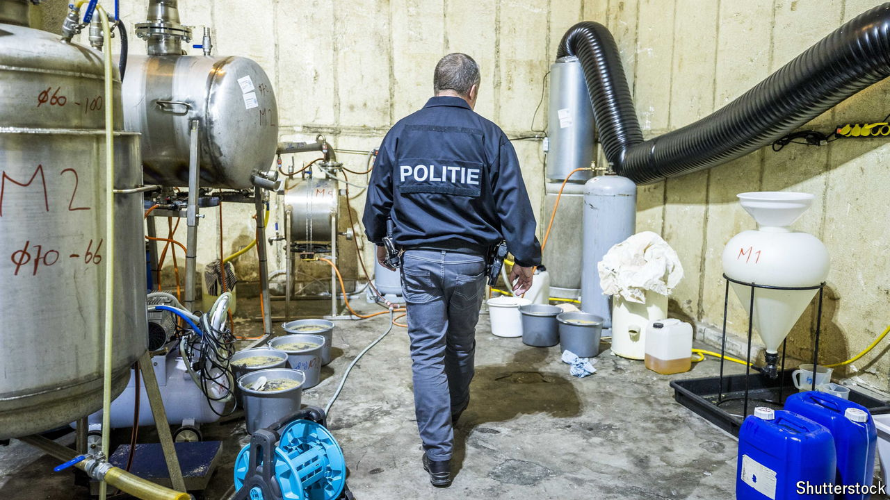

###### Home-made highs

# European gangs are getting better at making their own illegal drugs 

##### The faster the police can crack them down, the faster they adapt to new methods 

 

> Jun 27th 2024 

WHEN SPANISH police looked into a gang from the Canary Islands last year, they unwittingly landed on something big. In an unassuming house in Galicia, in north-western Spain, specialist teams were working around the clock to produce up to 200kg of cocaine a day. Two gangs, one Colombian, the other Mexican, had paid around €2m ($2.1m) to set up the lab, which the Spaniards supplied with cocaine base. It was only the second cocaine lab found in Spain. So far it is the largest ever discovered in Europe.

Cocaine was rarely produced in Europe until 2018. Increased coca production in Latin America and improved police surveillance have prodded some criminals into changing tack. While most still import the finished product, crooks increasingly get cheaper products like cocaine base, then turn them into cocaine hydrochloride (a white powder) using chemicals in labs. Many more extract cocaine that has been chemically hidden for shipment in the likes of charcoal, clothing and sugar. In 2022 39 cocaine labs were dismantled in the EU, up from 15 in 2019.

