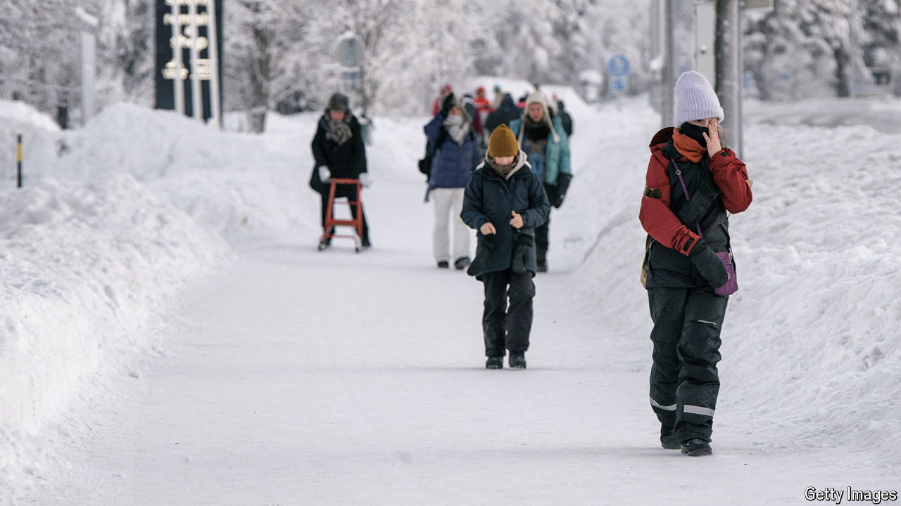

###### Getting them while they’re young

# Finland’s shrinking high schools are importing pupils from abroad 

##### And educating them at taxpayers’ expense 

 

> Jun 27th 2024 

IDEALLY, MARIANNE KORKALAINEN’S high school in Rautavaara, a tiny town in eastern Finland, would enrol at least 20 new pupils each year. This autumn, her shrinking municipality will send her only about 12. But Ms Korkalainen, the head teacher, has a plan: she intends to invite half a dozen youngsters from poorer countries to help fill her empty seats. Eager adolescents from places such as Myanmar, Vietnam and Tanzania will swap their tropical cities for her snowy bolthole. They will receive a Finnish education, at Finnish taxpayers’ expense.

School-age populations are shrinking in lots of European countries—and in Finland, faster than most. By 2030 the country could have nearly 10% fewer children aged 4-18, according to EU projections. By 2040 their ranks might be smaller by a fifth. This spells trouble in particular for rural schools, which suffer both from having few births and from migration to the cities. Hundreds have shut their doors in recent decades. Some now offer local youngsters bungs, such as free driving lessons and small cash “scholarships”, in the hope of keeping them around.

