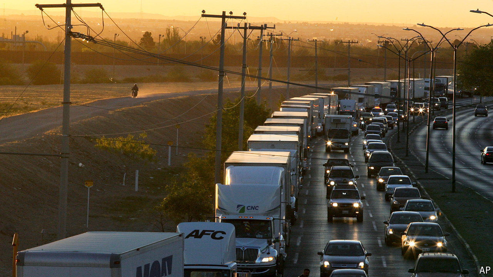
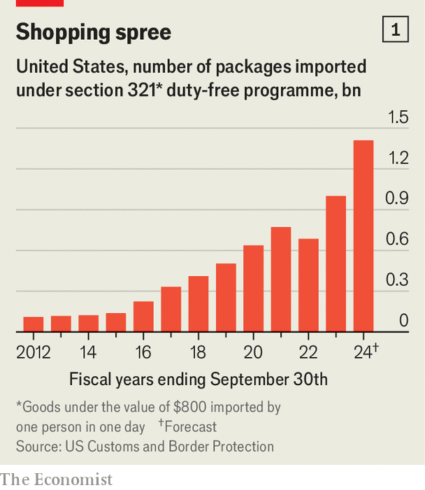

###### The Tijuana two-step

# How Chinese goods dodge American tariffs 

##### Policymakers are unsure what to do about a tricky loophole 

 

> Jun 27th 2024 

Queues of idle trucks trying to enter America are standard fare at Mexico’s border. Recently, however, vehicles at the Otay Mesa crossing, which separates California and the city of Tijuana, have been lining up to get into Mexico. The trucks do not travel far—they offload their shipping containers in newly built warehouses just 15km south of the border. The goods are then separated into thousands of small packages and driven back to America. Although such imports are made in China and purchased in America, no tariffs are paid. Call it the Tijuana two-step.

 


