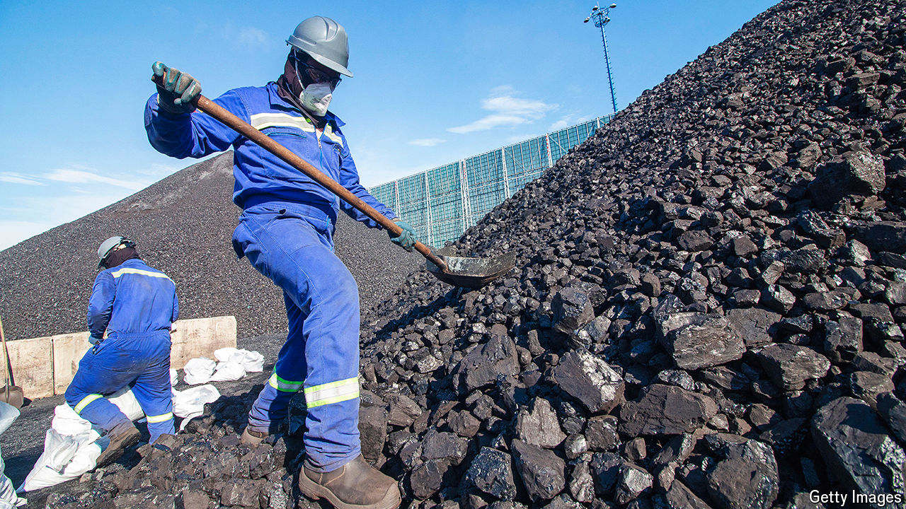
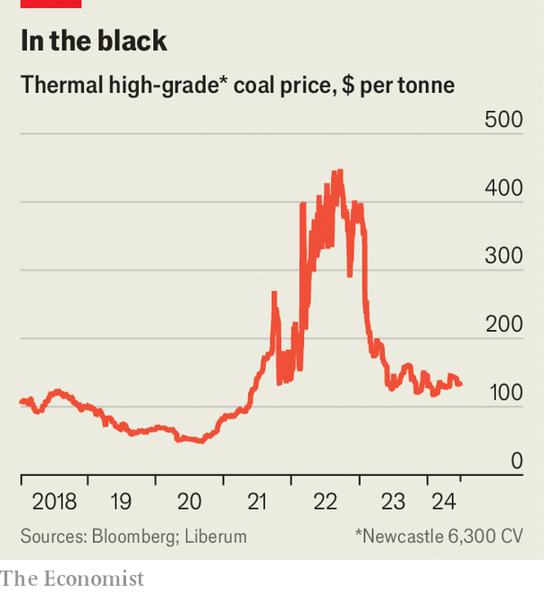

###### Rock steady

# Is coal the new gold? 

##### The world’s dirtiest fuel is a disturbingly safe investment 

 

> Jun 27th 2024 

From some angles it seems as if thermal coal, the world’s dirtiest fuel, is having a tough year. Prices are down a bit. China, which gobbles up over half the world’s supply, is in economic trouble; a surge in hydropower generation there is squeezing out the fuel. In May G7 members agreed to phase out coal plants, where emissions are not captured, by 2035. Mining stocks are trading at a huge discount.

 


