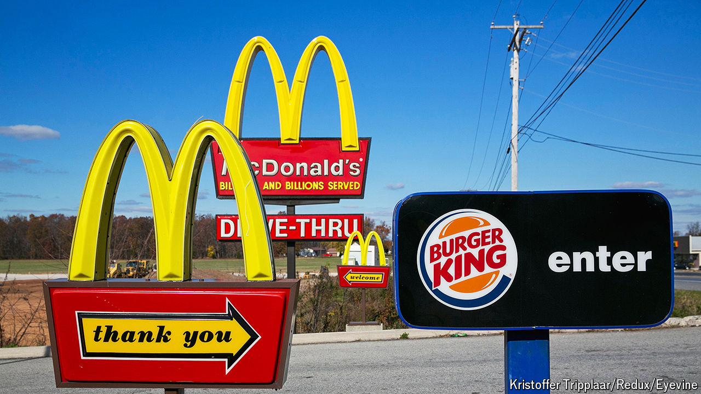

###### Biggie deal

# McDonald’s v Burger King: what a price war means for inflation 

##### American consumers will be licking their lips. So will Federal Reserve officials 

 

> Jun 26th 2024 

In the cartoon “SpongeBob SquarePants”, Mr Krabs, purveyor of krabby patty hamburgers, is a frequent and ruthless price-gouger. He can get away with it because he has no competition, save for the unappetising Chum Bucket. McDonald’s, a chain that flips real-world hamburgers, can only dream of Mr Krabs’s pricing power. It has been forced into a fast-food price war.

Since June 25th Americans hungry for a deal have been able to get a sandwich, fries, chicken nuggets and soft drink under the golden arches for just $5. Burger King, a rival fast-food chain, is matching the offer with a $5 meal deal of its own. The two are following in the footsteps of Wendy’s, which is temporarily adding an ice cream to its long-standing Biggie Bag combo. Starbucks, seemingly determined to protect its reputation for high mark-ups, is pricing a sandwich and a coffee at $6. McDonald’s calls this the “summer of value”; economists call it deflation. However labelled, the development is heartening for consumers—and for Federal Reserve officials, who would like to reduce interest rates before the year is out.

