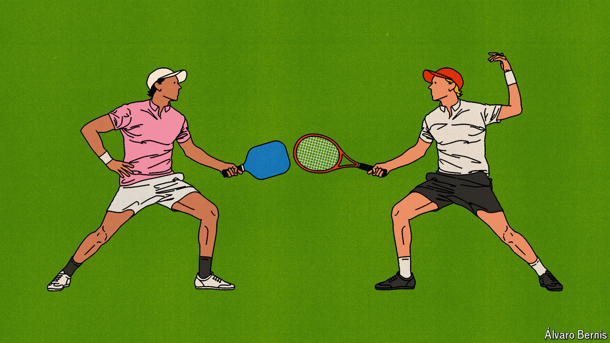

###### Free exchange

# The economics of the tennis v pickleball contest 

##### Don’t hate the new players—or the new game 

 

> Jun 27th 2024 

Which is the greatest rivalry in tennis? Older players might reminisce about the “fire and ice” contests between the cool-headed Bjorn Borg and the tempestuous John McEnroe; those a generation younger might rave about the all-American duels between Andre Agassi and Pete Sampras. After a two-decade-long era dominated by rivalries between Roger Federer, Rafael Nadal and Novak Djokovic, younger players are at last starting to shine. Carlos Alcaraz and Jannik Sinner, aged just 21 and 22, respectively, produce electric tennis—and have claimed four grand-slam titles between them since 2022. Do not be surprised if they meet again at Wimbledon, which starts on July 1st.

Yet these matchups look tame in comparison with the all-out war being waged between recreational players of tennis and those of pickleball—a sport that has gained widespread popularity in recent years, and which can be played on the same surface. In 2022 police in San Diego, California, had to be called to mediate a dispute when some pickleballers staged a takeover of a local tennis club. In Arlington, Virginia, a group called “Team Pickle-nah” leafleted the area around tennis courts due to be converted into pickleball ones, accusing pickleballers of hijacking courts, bullying children and urinating in public.

