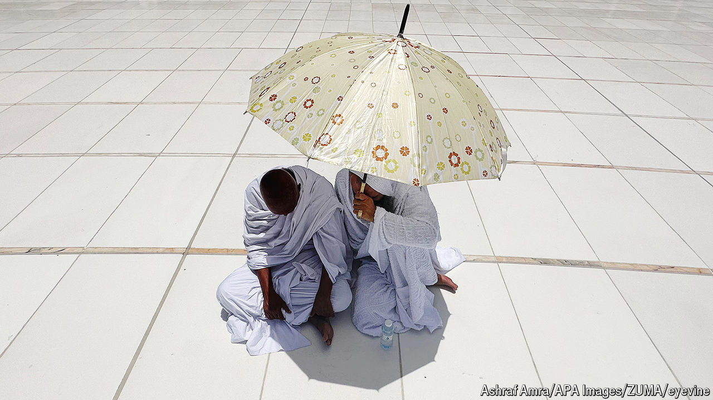
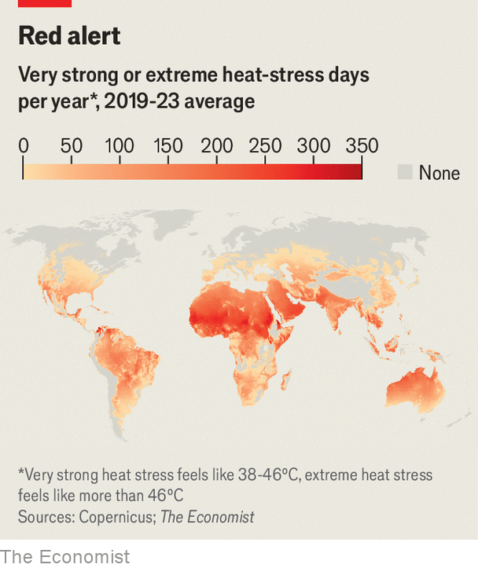

###### Extreme temperatures

# The rise of the truly cruel summer 

##### Deadly heat is increasingly the norm, not an exception to it 

 

> Jun 26th 2024 

In Japan it starts with the pulsating song of cicadas; in Alaska, with salmon swimming upstream. However it begins, summer in the northern hemisphere—where more than 85% of the world’s population live—soon involves . This year is no exception—indeed, it carries the trend further. In Saudi Arabia more than 1,300 pilgrims died during the , the pilgrimage to Mecca, as temperatures exceeded 50°C. India’s capital, Delhi, endured 40 days above 40°C between May and June. And in Mexico scores of howler monkeys have been falling dead from the trees with heatstroke.

 


