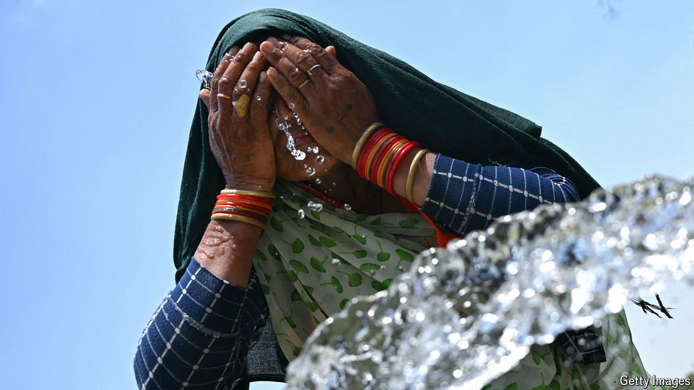

###### Global warming

# Simple steps to stop people dying from heatwaves 

##### As much of the world roasts, don’t despair 

 

> Jun 26th 2024 

WHEN A HEATWAVE in Europe killed more than 70,000 people in 2003, it was seen as a once-in-a-millennium event. Today, experts say, such blistering heat can be expected once a decade. Worldwide, last year the months of June, July and August were the hottest on record. August 2023 was on average 1.5°C hotter than the same month between 1850 and 1900. This year could be even worse. 

The bad news is on every screen this summer. In Saudi Arabia, as temperatures hit 50°C in the shade, 1,300 of the pilgrims who flocked to Mecca for the have died. On June 23rd 100m Americans were living in areas subject to heat warnings, with Baltimore and Philadelphia approaching a scorching 40°C. Indians suffered 40,000 cases of heatstroke between March and mid-June, with Delhi recently enduring 40 consecutive days over 40°C. Far from being a series of freak events, this is the new normal. 

