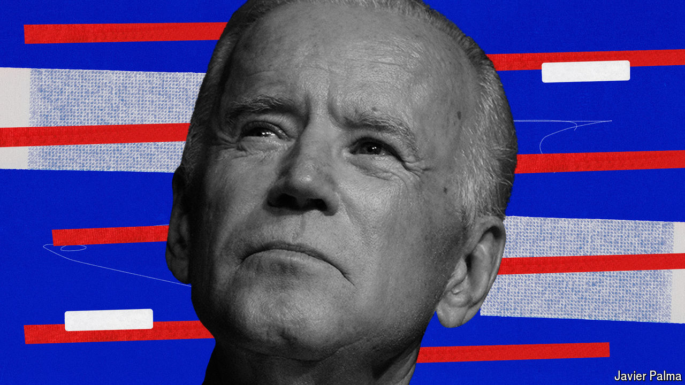

###### Governing America

# What to make of Joe Biden’s plans for a second term 

##### His domestic agenda is underwhelming, unrealistic and better than the alternative 

 

> Jun 27th 2024 

Some politicians are shy about revealing their ideas before elections for fear of alarming the voters. Others simply do not have very much to say. Which type is Joe Biden, as he pitches for a second presidential term? His domestic-policy plans have received much less scrutiny than Donald Trump’s.  is a first attempt to make up for that. The most positive thing to say about this president’s platform is that the alternative is a lot worse.

Mr Biden came to power in 2021 with a grand vision to remake the American economy for the middle class. His foreign policy was organised around this goal, too. FDR was mentioned. In office he was constrained by the Senate. Without the votes to overcome the filibuster, Bidenomics had to be implemented through giant budget bills and regulations. Some of the results have been beneficial, particularly in spurring investment in green technology. But overall, Mr Biden has placed far too much faith in regulation, protection and intervention, rather than animal spirits, to boost the economy.

