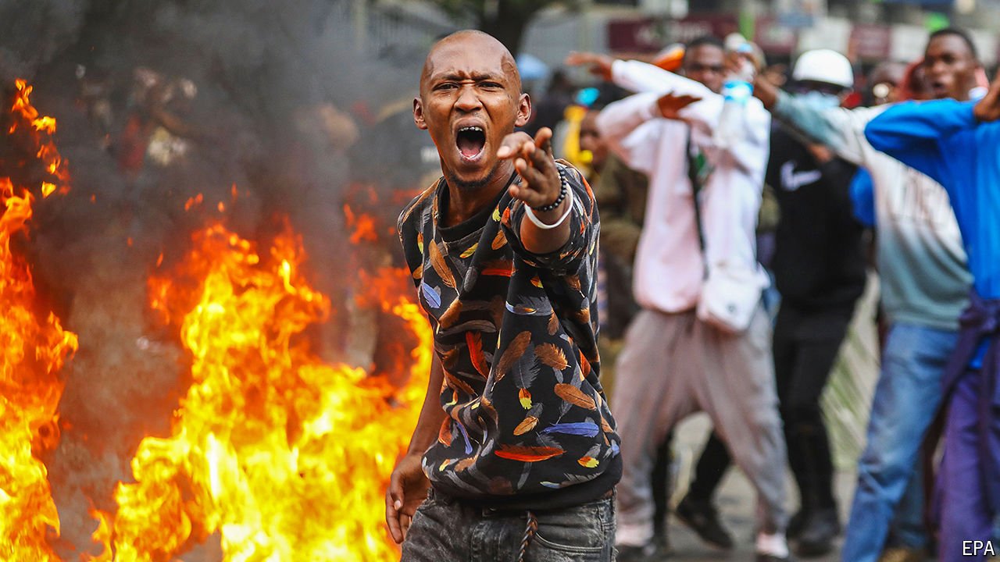

###### Breaking the budget

# A new breed of protest has left Kenya’s president tottering 

##### President Ruto has capitulated to people power and cancelled hated tax increases 

 

> Jun 27th 2024 

Though Kenya’s equilibrium is occasionally punctured by bouts of political unrest, the country is generally seen as fairly stable, prosperous and liberal. Such cosy assumptions, however, were rudely jolted by tax riots, which reached a deadly peak on June 25th. Overwhelming the police in Nairobi, the capital, protesters broke into Parliament, set fire to a section of it, pinched the mace and forced terrified MPs to flee. The security forces responded with live fire, killing at least 23 people.

Kenya now stands in uncharted territory. Not only was Parliament overrun, protests also erupted in at least 35 of the 47 counties, including in the highland heartlands of William Ruto, its suddenly embattled president. Even more startling than the widespread nature of the protests were the attacks on offices of Kenyan MPs and local government officials seen as aligned with Mr Ruto’s tax policies. Rarely has hatred for the political class felt so acute.

