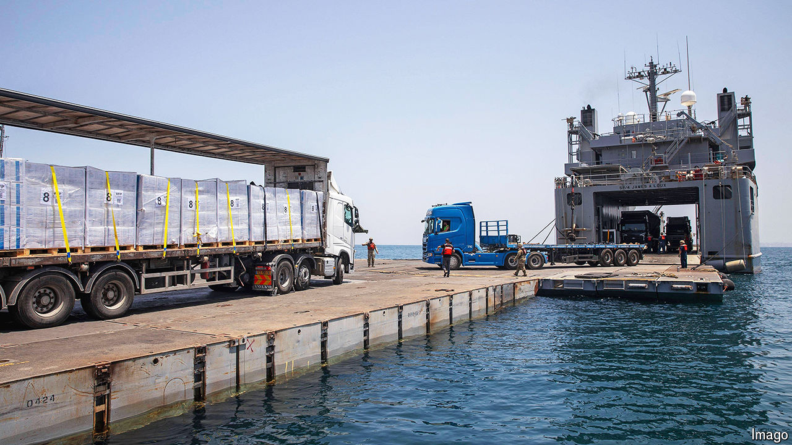

###### Pier pressure

# Is the American-built pier in Gaza useful or a fiasco? 

##### The Economist went to see 

 

> Jun 26th 2024 

FOR six kilometres the road is a dusty moonscape without a hint of civilian life. The Netzarim corridor, as Israel calls it, slices across Gaza’s narrow waist, from its border with Israel to its Mediterranean coast. The buildings on both sides have been pancaked into piles of rubble. As a convoy bounces along the rutted track, there are no Palestinians in sight, only Israeli soldiers and army vehicles and a constant swirl of grit. And then there is a dazzle of blue: the corridor ends at the sea, and the hulking steel pier that America spent $230m to install on Gaza’s shore.

In March, when Joe Biden announced the pier, he made it sound straightforward. Gaza had a problem with hunger. America had a whizzy solution; a modular floating causeway that its army would haul halfway around the world and assemble in the Mediterranean. It would, the president said, provide a “massive increase” in aid.

