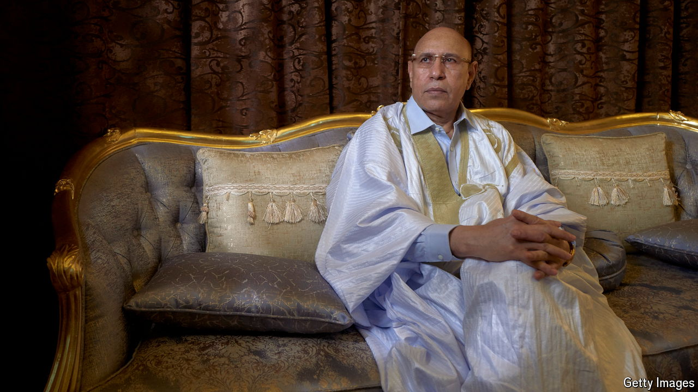

###### Surrounded by trouble

# Mauritania is a beacon of stability in the coup-prone Sahel 

##### But disorder is knocking at its door 

 

> Jun 27th 2024 

Mohamed Ould Ghazouani seems an unlikely stalwart of stability. President of Mauritania since 2019, the former general has participated in no less than two of the six coups that shook the country in the first five decades after its independence from France in 1960. In the first putsch he helped boot out Maaouya Ould Sid’Ahmed Taya, who had ruthlessly repressed people for two decades after himself seizing power in a coup. In the second, he helped topple the country’s first democratically elected president and replaced him with his old friend, Mohamed Ould Abdel Aziz, who then went on to win two terms as president. 

And yet Mr Ould Ghazouani has presided over a period of unprecedented calm. Though marred by the arrest of opposition figures, his election in 2019 marked Mauritania’s first-ever peaceful transfer of power. He has co-operated with opposition parties, expanded social security and sidelined Mr Aziz, his predecessor, who was jailed for corruption in December. As defence minister and then president he also played an influential part in ousting al-Qaeda in the Maghreb, an Algeria-based jihadist group that launched a series of deadly attacks in Mauritania between 2005 and 2011. A combination of community outreach, mediation with Islamists, and military modernisation has uprooted extremism. Mauritania has been free of terrorism for over 13 years. Mr Ould Ghazouani is expected to win a second term in office in the presidential election scheduled for June 29th, which the UN reckons will be fair and peaceful. 

