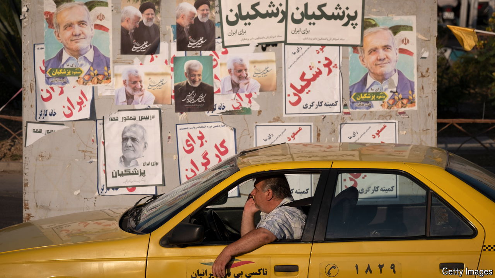

###### No thanks

# The job of Iran’s president is a study in humiliation 

##### Yet people stand for it in their droves 

 

> Jun 27th 2024 

Pity the Islamic republic’s elected presidents. For over three decades their fates have ended in censure, ignominy or early death. The last, Ebrahim Raisi, died in May in a mysterious helicopter crash. Akbar Hashemi Rafsanjani, a president in the 1990s, suddenly died in his swimming pool. Mir Hossein Moussavi, a contender many Iranians believe lost the election in 2009 to rigging, has spent 13 years under house arrest. Muhammad Khatami is banned from the airwaves, Mahmoud Ahmadinejad is banned from travel. Several remain butts of public ridicule.

“The affairs of the country must be administered on the basis of public opinion expressed by the means of elections,” says the constitution, and it names the president as Iran’s second highest official. But his prerogatives are hobbled by myriad unelected forces wielding real power. The Islamic Revolutionary Guard Corps, the regime’s crack force, the state broadcaster and a triad of assemblies and councils vet all posts, including the president’s. At the pinnacle the supreme leader, Ayatollah Ali Khamenei, answers only to God.

