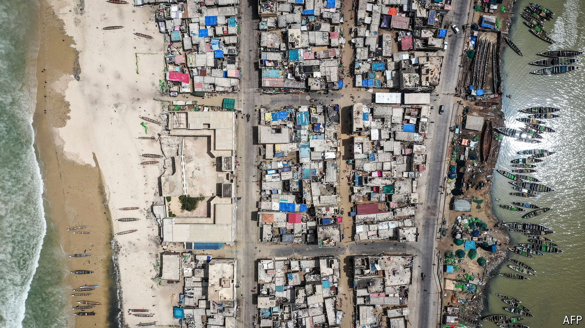

###### Extreme weather

# The “Venice of Africa” is sinking into the sea 

##### Megacities on the continent’s western coast are being swamped by rising oceans 

 

> Jun 24th 2024 

It may not look like much any more, but in its heyday La Chaumière was “the premier nightclub in all Saint Louis”, recalls Cheikh Badiane. When the tide was low, the long beach extending far into the distance was wide enough for crowds to gather for football matches on the sand. But in recent years, the ageing fisherman says, “so many catastrophes have happened.” La Chaumière is closed. The Koranic school along the waterfront is no more. A few years ago, during a particularly terrible flood, a house next to a mosque collapsed, killing the carpenter who lived there. These days, when the storm-surge comes, the waters go all the way to the war memorial a couple of hundred metres inland. Inch by inch, home by home, Saint Louis is being washed into the sea. 

A crowded island city built among waterways,  former colonial capital—dubbed the “Venice of Africa”—is especially exposed to a changing climate and . The thin peninsula on which fishermen like Mr Badiane live has the Atlantic on its west and the mouth of the Senegal river on its east. A botched attempt, in 2003, to reduce flooding by digging a canal only worsened things, putting a whole neighbourhood under water. A study commissioned by the Senegalese government found that 80% of the city will be at risk of flooding by 2080. “Saint Louis is a city of water,” says Mr Badiane. “If we’re not careful, it will all disappear.”

