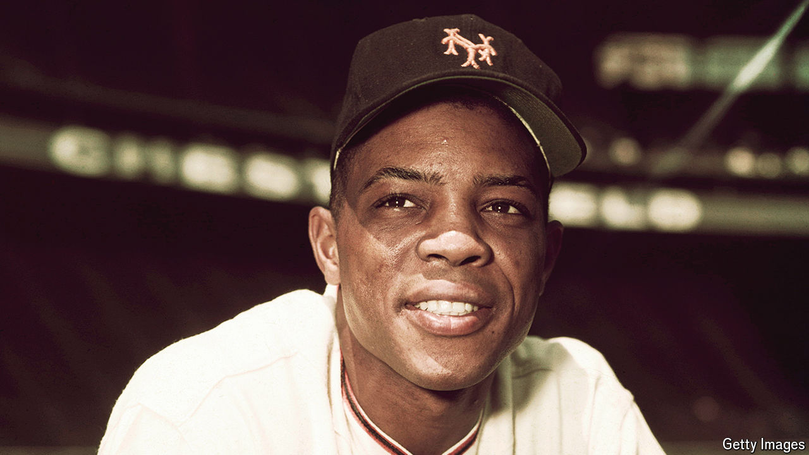

###### Just keep having fun

# Willie Mays’s philosophy was simple: They throw the ball, I hit the ball 

##### Possibly the best baseball player ever died on June 18th, aged 93 

 

> Jun 26th 2024 

Around nine o’clock in the morning, a tap would come at his window. Outside his house in St Nicholas Place in Harlem milled a group of grinning boys. They carried mop-handles and a pink bouncing ball, all the equipment they needed. The street and the parked cars would provide the rest. What they wanted was to play stickball, and he was only too eager to join them. He’d play for an hour, morning or evening, as his job allowed. Soon he was crouching, swinging the stick, just an ordinary man in a Polo shirt and trousers. But when he made contact he whacked the ball so hard that it went for three or four sewers, or three or four city blocks. Because, after all, he was Willie Mays, then the star of the New York Giants. 

Playing stickball taught him how to hit curveballs. You never knew how the surface of the street might skew that high, wild bounce. Apart from that, though, he did not have much to learn. His father, nicknamed “Cat” for his slinky prowess on the field, had played baseball between jobs down near Birmingham, Alabama. It was he who taught him how to be a centre fielder and to stick with the game. At 16, playing practically barefooted, he already knew exactly what he had to do. His body was built for baseball, strong, sinewy and graceful, like his Dad’s. He could hit a ball out of the park, defend, outsmart anyone and catch mostly anything. Easy. That happy certainty lasted years.

